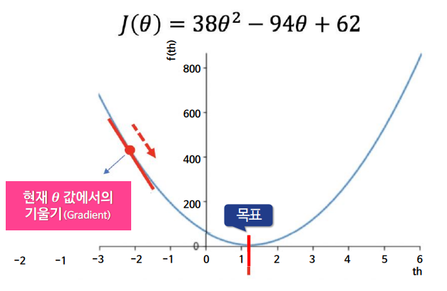
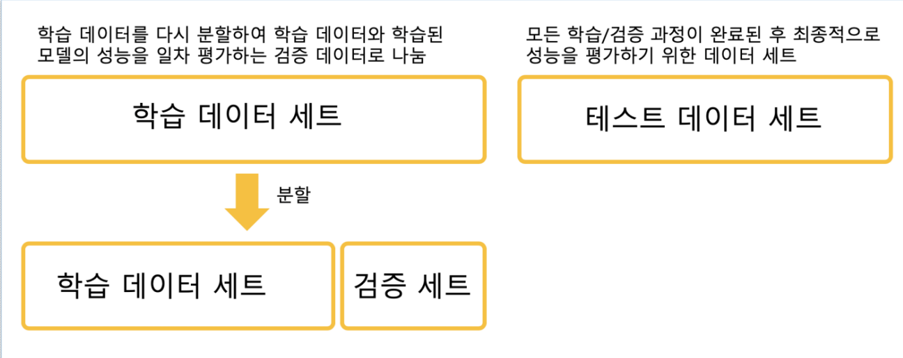
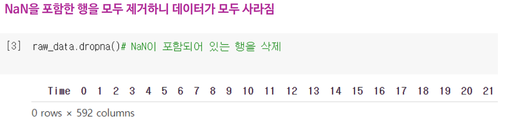

지도학습 - 학습할 데이터에 예측하고자 하는 특징인 Label이 주어짐
회귀 - 지도학습의 한 형태로 연속된 값 예측. 주어진 데이터셋과 가깝게 선을 그리는 것

분류 - 지도학습의 한 형태로 불연속적인 값 예측. 주어진 데이터셋을 둘로 잘 나누는 선을 찾는 것

결정나무기법 - 분류 모델을 만드는 알고리즘 중 하나로, 계속 질문 해나가며 주어진 데이터셋을 분류

데이터는 훈련용/검증용/테스트용 으로 나누는 것이 중요함 => 그래야 과적합이 안 생기니까

회귀에서 선이 데이터셋과 가까워 짐을 어떻게 측정할까?
=> Cost Function 수직거리 제곱의 합계를 사용. 그냥 수직 거리의 합은 오차에 덜 민감함

경사하강법
산 꼭대기에서 안개 낀 상태로 내려가는 것 
학습률의 영향
너무 작다	느리게 수렴, 반복 많이 필요
너무 크다	최소값 지나치고 진동하거나 발산할 수 있음
적당할 때	빠르고 안정적으로 수렴

커널 기법
데이터를 나눌 수 없는 경우에, 저차원의 공간을 고차원으로 올려서 직선으로 해결하는 방식
2차원에서는 원 형태로 분포되어 있으면 직선으로 못나눔
=> 3차원으로 확장하면 평면으로 나눌 수 있음
=> 그걸 다시 2차원으로 보면 원 같은 경계가 생김 = 커널 트릭
비선형 데이터 처리 가능, 커널 트릭을 통한 계산 효율성 증가, 성능 향상

확증적 데이터 분석 - 목적을 가지고 데이터를 수집하고 분석하는 방법

데이터 분석 절차
1. 분석할 데이터 수집
2. 데이터를 읽고, 해석하기 쉽도록 "데이터를 정제"
3. 데이터 탐색
4. 예측 모델 생성(모델링)

과적합을 방지하기 위해 검증 단계도 필요함

폴드 - 데이터셋을 나누는 하나의 조각

K겹 교차 검증

데이터를 K개의 폴드로 나누어, K번 학습/검증
모든 데이터가 한번씩 검증에 사용도미

클래스 불균형이 있는 경우, 각 폴드에 동일한 클래스 비율 유지

반복문에서 수행하는 교차검증이 조금 귀찮다면 : CROSS_VAL_SCORE사용

True, False는 실제와 예측이 맞았는지 여부
Positive, Negative는 예측값

실제로 True 인 것을 Negative로 예측함
=> False Negative

1. Accuracy (정확도)
전체 중에서 맞춘 비율

2. Precision (정밀도)
모델이 생존이라고 예측한 것 중 실제로 생존한 비율 

3. Fall-out (거짓 양성률)
실제 사망자인데 생존이라고 잘못 예측한 비율

4. Recall (재현율, 민감도)
정답(실제 1) 중에서 모델이 맞게 1이라고 예측한 비율 TP

Recall은 위, Fall-out은 아래, Accuracy는 전체, Precision은 Positive

예측 확률에 대한 기준값(Threshold)을 바꾸면 Precision과 Recall이 반비례 관계로 변화함
Threshold는 생존할 확률?? 으로 생각해면 좋음

실제 양성인 데이터를 음성이라고 판단하면 안되는 경우라면, Recall이 중요하고, 이 경우는 Threshold를 0.3 혹은 0.4로 선정해야 함 (eg. 암환자 판별)
=> Threshold가 낮으니까 양성이라고 많이 예측하기 때문에 Recall이 증가하고, 틀린것도 많기 때문에 Precision이 낮아짐

실제 음성인 데이터를 양성이라고 판단하면 안되는 경우라면, Precision이 중요하고, 이 경우는 Threshold를 0.8 혹은 0.9로 적합할 수 있음 (eg. 스팸메일)
=> 확실한 것만 양성으로 예측하기 때문에 Precision이 증가하지만, 많이 놓치니까 Recall이 낮아짐

ROC와 AUC
ROC

x축은 Fall-out, y축은 Recall
직선에 가까울수록 성능이 떨어지고, 좌상단에 갈수록 성능이 좋음

AUC

ROC 아래의 면적으로, 일반적으로 1에 가까우면 좋은 성능
기울기가 1인 직선 아래가 0.5 이기 때문에, AUC는 0.5보다는 높아야 함

하이퍼 파라미터 - 모델이 학습되기 전에 사람이 직접 설정해주는 값 
이 값들을 바꾸면 성능이 확 달리짐 -> 튜닝 필요

각각의 조합에 대해 모델 학습 -> 정확도 비교
가장 좋은 조합으로 최종 테스트에 적용

인디언 당뇨병 예측
로지스틱 회귀 모델 사용
의료 분야에서는 Recall이 매우 중요. 환자를 놓치면 안되기 때문

0값이 의미 없는 경우, 평균 값으로 대체

앙상블 학습
여러 개의 머신러닝 모델을 결합해서 더 정확한 예측을 얻는 방법
분류기 하나의 오류율이 5퍼여도, 서로 다른 5개의 분류기의 투표로 결정하면 오류율이 0.01%로 낮아질 수 있음

Baggig
데이터를 여러 번 샘플링해서 같은 알고리즘으로 여러 모델 생성
각 모델 결과를 투표로 결장
대표 모델로는 Random Forest(여러 결정트리 만들고 투표)

Boosting
하나의 모델이 틀린 부분에 가중치를 더해 다음 모델이 집중해서 학습
대표 모델로는 Adaptive Boosting

countplot은 카테고리형 변수의 각 값이 몇 번 나왔는지 세서 막대그래프로 보여주는 함수로, 사진에서는 극심한 클래스 불균형이 있다는 것을 확인할 수 있다.

결정나무 트리
너무 복잡한 트리의 경우 과적합 가능성이 있음
하이퍼 파라미터 조정을 하려면, max_depth 또는 min_samples_splitf를 바꿈

Clustering
비지도 학습의 대표적 기법으로, 라벨이 없는 데이터를 유사성 기반으로 그룹화
개/고양이의 경우 사진은 구분되지 않았지만, 형태나 색이 비슷한 것 끼리 묶음

지도 학습 - 정답(라벨)을 제공하여 학습
비지도 학습 - 라벨없이 스스로 패턴을 찾아냄

K-means 알고리즘
1. 초기 중심점 k개 설정
- cluster 수 k만큼 랜덤하게 중심점 설정
2. 클러스터 할당 단계
- 각 데이터를 가장 가까운 중심점에 할당
3. 중심점 이동
- 클러스터 안에 데이터 평균값으로 중심점 이동
4. 2~3단계를 반복
5. 종료
군집화는 데이터를 공간상에서 가깝게 모이는 것들끼리 묶는 것

init = kmeans++는 초기 위치를 서로 떨어져있게 함

plt.figure은 전체 그래프의 크기를 설정 
irisDF라는 데이터프레임에서 x축은 'petal_length', y축은 'petal_width'
hue='species' → 품종별로 색상 다르게 표시
style='species' → 품종별로 마커 모양도 다르게
s=100 → 마커(점)의 크기 100
scatterplot() 함수의 style은 마커의 형태를 자동으로 다르게 해주고, s는 마커의 크기를 지정함
scatter 은 중심을 빨간색 r 동그라미로 시각화
show는 지금까지 설정한 그래프를 화면에 출력

반도체 공정 실습 데이터

NAN 데이터를 세는 방식
.insa() 는 NaN이 있는 곳을 True, 없는 것을 False로 표시
.sum()은 각 열마다 True의 개수를 더함

drop na 로, Nan이 하나라도 있는 행은 삭제

raw_data.fillna(raw_data.mean())
NaN을 각 열의 평균값으로 대체

sns.heatmap(corr_matrix)
변수 간 상관계수 시각화
비슷한 변수 찾기, 중복 변수 제거에 도움

df.boxplot(column=col)
특정 컬럼의 이상치 시각화
이상값 탐지 목적 (1.5 IQR 밖에 있는 값들)

df.corr()
피처 간 상관계수 계산
클래스(불량 여부)와 연관된 중요한 피처 추출 가능

MinMaxScaler(), StandardScaler()
정규화/표준화 처리
모델 학습이 잘 되도록 데이터 범위를 조정

MinMaxScaler 는 모든 값을 0과 1 사이로 변환
StandardScaler 는 데이터를 평균 0, 표준편차 1로 맞춤

이상치가 높은 인덱스를 찾아냄
1사분위수 25% 와 3분위수 75%
IQR = Q3 - Q1 (데이터의 중간 범위)

lowest_val = quantile_25 - iqr_weight
highest_val = quantile_75 + iqr_weight
정상 범위의 최소~ 최댓값을 정의하고, 이 기준 값을 벗어나면 이상치로 판단

데이터 불균형 발생시 성능에 문제가 발생할 수 있음
전체 90%가 정상이면, 모델이 -1만 예측해도 정확도가 90%가 되어버림
하지만, 실제로 중요한건 불량 예측이라서, Recall=0 이면 의미없음

OverSampling
Fail이 너무 적으면 학습을 못하니까, Fail 샘플을 늘려버림
SMOTE : Fail을 가상 데이터로 증가
RandomOverSampler : 단순 복제

기계 학습 - 데이터로 학습하여 성능을 높임

인공 신경망 - 인간의 뉴런을 본떠 만든 기계학습 모델
입력층, 은닉층, 출력층이 존재
복잡한 패턴 추론 및 비선형 관계도 추론 가능

심층 인공 신경망은 은닉층의 개수를 늘린 모델

딥러닝

장점
- 오픈소스 알고리즘이 풍부하여 저렴하고 빠르게 개발 가능
단점
- 학습 데이터 확보에 많은 시간과 비용이 듦
- 과적합 발생 가능
- 인간이 내용을 해석하거나 개선하기 어려움

적용 사례

퍼셉트론 - 숫자 값을 다른 함수로 넘겨주는 프로그램

단층 퍼셉트론

신호합산 - 입력되는 신호를 연결 강도와 곱한 후 모두 합하는 부분
활성화 - 합산된 신호를 다음 계층으로 신호를 보낼지 말지 결정하는 부분

활성화 함수
다음 층으로 신호를 전달 시 신호의 총합을 출력 신호로 변환하는 함수

sigmoid를 사용하면 출력값이 0~1 사이로 변환되는데, 층이 많아지면 0으로 수렴하는 문제가 발생
=> 0보다 작은 값은 모두 0으로 만들어 버리고 0보다 큰 값이 나오면 그대로 값을 반환하는 ReLU 함수 사용

입력값에 가중치를 곱하고, 모두 합할때 행렬을 사용

And-OR 회로를 퍼센트론으로 만들기

입력값X에 가중치W를 곱하고, 모두 더한 값이 임계값 S를 넘으면 1 출력, 아니면 -1

두 신경 세포가 함께 활성화되는 정도는 두 신경세포가 내는 신호의 곱이고, 함께 연결된다는 것은 연결의 강도 W(xy)가 커진다는 것
=> W(xy) = 신경세포 x와 신경세포 y가 내는 신호의 곱

연결 강도를 변경할 수 있다는 것은 신경세포의 연결망을 학습시킬 수 있다는 의미

x,y의 다음 가중치 = 현재 x,y의 가중치 + 신호합산

퍼셉트론의 학습은 신경 세포의 활성화가 아니라, 가중치가 제시된 출력 목표치 t를 만족하는 것!

출력 노드가 가지고 있는 활성화 함수를 거쳐 나온 출력을 y(hat)인데,
y(hat)과 t가 일치하면, 퍼셉트론이 제대로 동작하는 것이므로 가중치 변경X
일치하지 않는다면, 가중치를 변경하는데 학습률 기반으로 가중치 갱신

목표 값 기준으로 갱신 방향을 정해야 함!

Δw=learning rate×error×input
위에서 부터 순차적으로 진행되며, error=0 이면 가중치가 변경되지 않음

퍼셉트론은 XOR 연산을 못함
왜냐면 두 개의 입력에 가중치를 곱하여 얻는 값은 선형 함수일 수 밖에 없음
하지만 XOR의 해는 선형 분리 함수임

XOR연산의 결과값은 비선형 함수
비선형 함수를 만드는 방법 중 하나로, 입력층과 출력 층 사이에 신호를 중계하는 은닉 노드를 두는 것

다층 퍼셉트론으로 XOR을 구하는 방법은 OR, NAND, AND 회로의 조합으로 가능
다층 퍼셉트론은 XOR 문제 보다 더 어려운 문제도 해결 가능하며, 신경망이라 불림

다층 퍼셉트론의 가중치를 갱신시키며, 최적의 가중치를 찾은 **오차 역전파** 알고리즘
많은 층을 가진 네트워크를 학습시키는 알고리즘이 딥러닝

Loss function
예측 값과 실제 값과의 차이를 표현하는 지표

