## Question
- what should an address be associated with?
- what structure should addresses have?
- who determines the particular addresses used in the global internet? What the implications of how this is done?
## IP Connectivity
- Addressing
- Forwarding
- Routing

# Addressing
- IP는 interface에 associate 되어야 함
- Global 하며 unique 해야함
- Exceptions
- - DHCP - 한정된 IP를 관리해서 넘겨줌
- - NAT - 내부적으로 private network 사용
- IPv4 - 32bits long으로, network number와 host number가 존재
- IP 주소를 기반으로 packet들을 forwarding 해줌

# IP Header
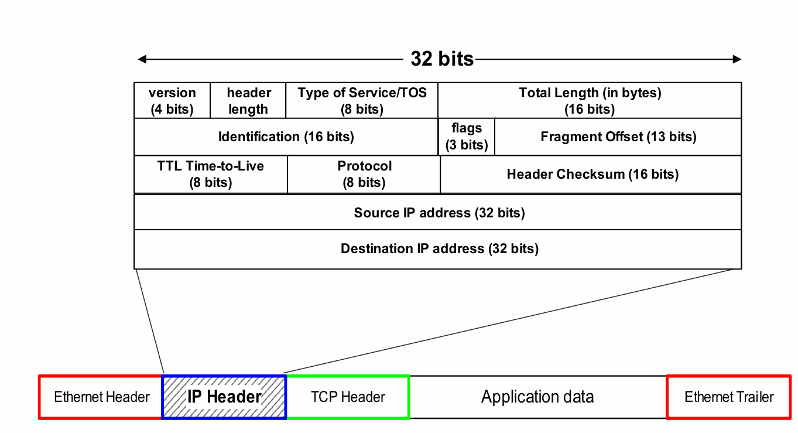

# What are addresses Used for 
- network forward
- router forward
- switches는 내부에서 전달만 해줌(길이 정해져 있음) 

# Who owns IP address?
- ICANN - IP 주소 관리 및 배분, root server 관리

# Network prefix
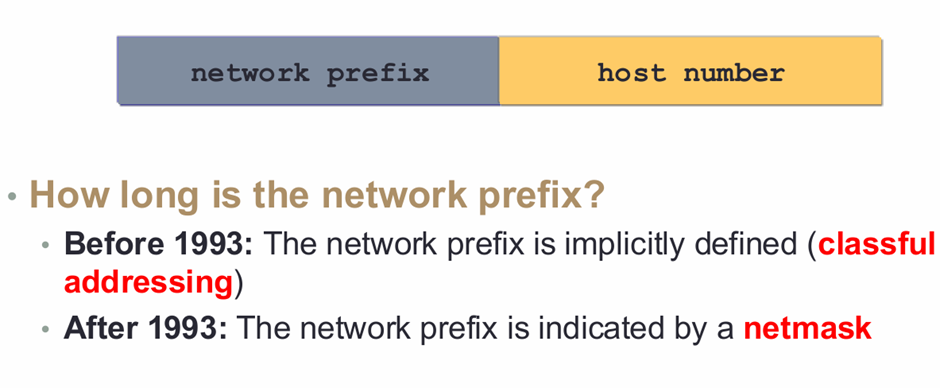

- 전체 32bit 
- Domain name은 바꾸지 않고, ip 바꾸기 가능 

## Classful IP Address
- Class A - 8bits long + 24bits host number로 host 많이 사용 가능한 좋은 IP
- Class B - 16bits long
- Class C - 24bits long
- Class D - 멀티 캐스트용
- Class E - 예비용
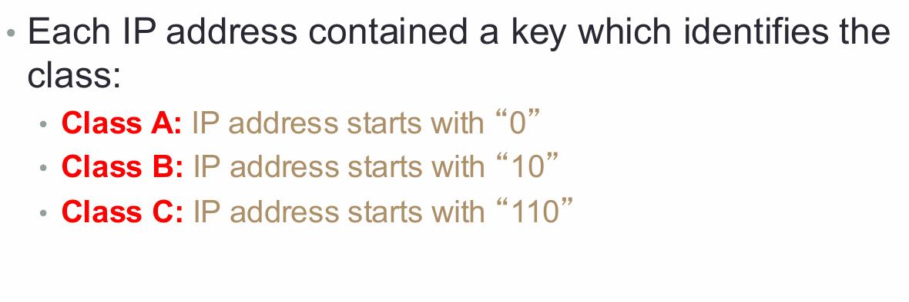
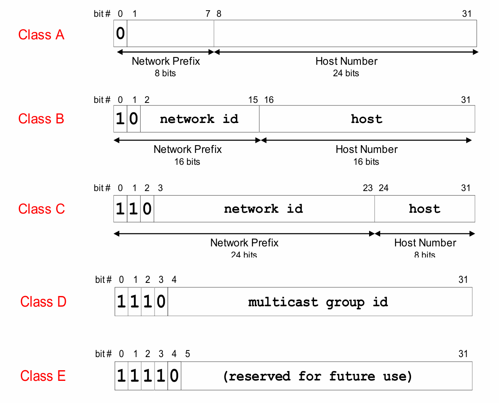
- 앞에 indentify key bit만큼 빼줘야 함. C는 21bit 개의 네트워크 존재
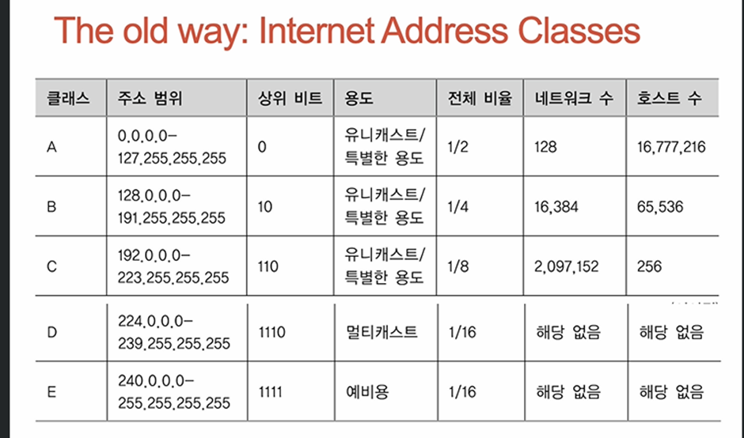

# Class 방식의 문제점
- Flat address space
- Class A와 B는 과하게 할당되었고, Class C는 너무 적게 할당됌

# 해결 방안
- Classful한 ip들 삭제
- CIDR방식

## CIDR
- IP에 대한 새로운 해석으로, network prefix의 길이를 자유롭게 사용하되, 길이 명시
- Network number = IP address + prefix length
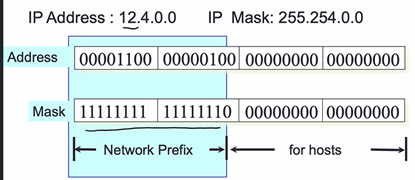

- 12.4.0.0/15라고 명시해줘야함.

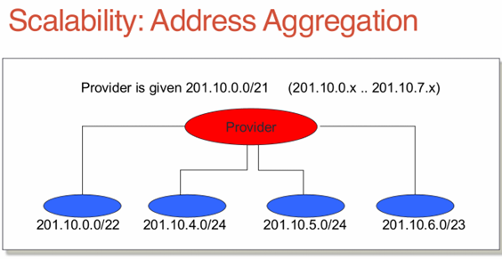

- 이제 확장성이 좋아져서, 큰 블록을 기업에 넘겨주면 기업에서 고객들에게 쪼개서 할당

## Subnetting
- 독립적으로 관리해야 될 네트워크는 내부적으로 따로 관리하자

# CIDR과의 차이점
- CIDR은 network와 host를 정해진 bit에서 가변적으로 사용
- Subnetting은 bit를 hierarchy하게 나눔
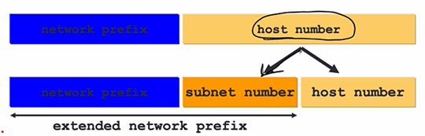

# Subnetmask
- IP - 166.104.0.0./16
- Subnet IP - 166.104.239.0/24
- Subnetmask – 255.255.255.0
- Subnetmask는 네트워크와 host를 구분하는 역할
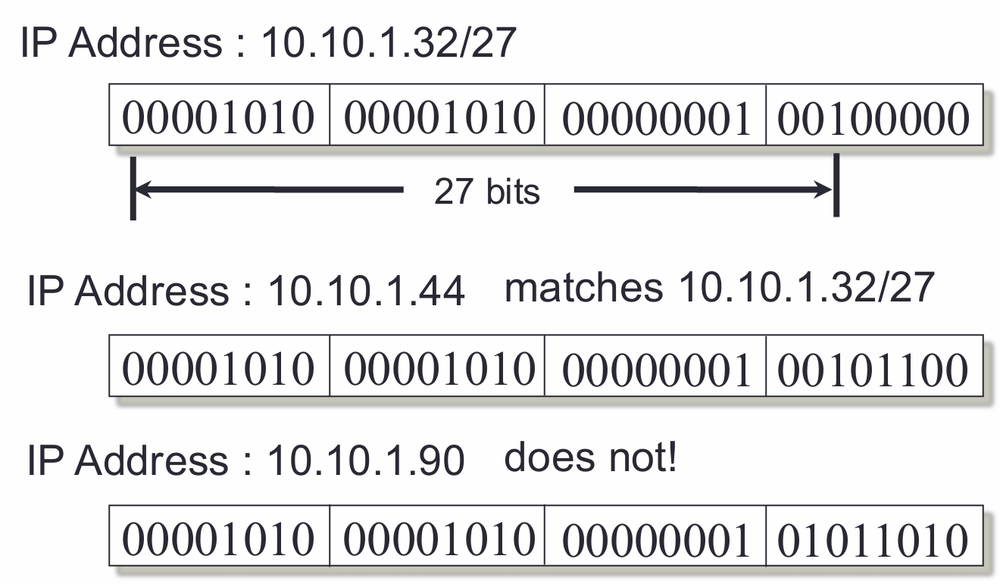

- match 하는 ip인지 subnetmask 잘 확인 해보는 것이 중요

# Subnetting Advantages

- Network, Subnet, Host 로 3계층 구조를 가짐
- 시스템 자체의 complexity는 증가하지 않음
- router의 complexity가 줄어듦. 여러 개의 라우터를 신경쓰지 않아도 되니까.

# VLSM
- Subnet의 크기를 원하는대로 조절 가능
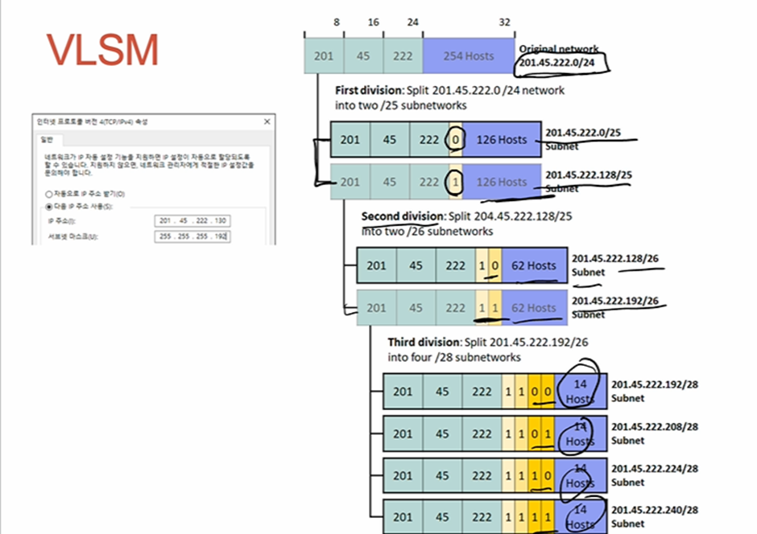

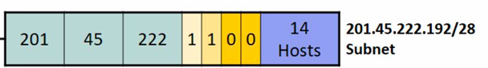
Host가 4bit이므로 총 16명. 그러면 host가 192~207까지인데, 끝과 끝 제외 
-> host 14명 
# Multicast address
- Source IP에는 전송자 IP, Destination IP에는 group IP를 사용
- 224.0.0.1을 사용하면 subnet(group)내의 모든 interface를 destination으로 사용
- 224.0.0.2을 사용하면 subnet(group)내의 모든 router을 destination으로 사용
- 224.0.0.0 ~ 224.0.0.255 는 일반적인 multicast 주소 제어를 위해 사용
- 224.0.1.0 ~ 238.255.255.255은 전 세계적으로 multicast 가능
- 239.0.0.0 ~ 239.255.255.255 관리자에 의해 정의되며, 특정 로컬 네트워크에서 사용 가능

## Broadcast Address
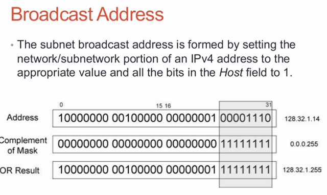

- prefix 자리를 제외하고, host 자리를 1로 다 채움
- 예시의 경우 128.32.1.14/24

# Limited broadcast
- Subnet 안에서만 전달하는 broadcast
- Subnet 안에서만 전달하므로 255.255.255.255 가능

# Directed broadcast
- Network broadcast: 네트워크 내의 모든 호스트에게 broadcast. 호스트 필드의 모든 비트를 1로 설정 (166.63.255.255는 네트워크 166.63.0.0에 대한 브로드캐스트)
- Subnet-directed broadcast: 특정 subnet에 broadcast. Subnet 내의 호스트 필드의 모든 비트를 1로 설정 (166.63.160.255는 서브넷 166.63.160.0)

실제로는 directed brodcast가 진행되면, router은 Smurf attack때문에 discard 함

## Special Addresses
# Loopback interfaces
- 127.0.0.1~127.255.255.255는 local host (127로 시작하면 loopback)
- 주로 127.0.0.1을 사용

# Private address
- 사설 주소는 내부 네트워크에서만 사용하도록 예약된 주소로, 사용하면 drop됨
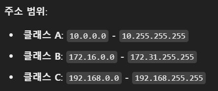

# This machine
- 0.0.0.0 주소로, 시스템이 아직 IP를 할당받기 전이나,IP 주소를 지정할 때 사용되는 임시 주소

# Convention
- default 게이트웨이 주소는 관례적으로 호스트 번호가 1로 설정 
설계에 따라 다를 수 있음.