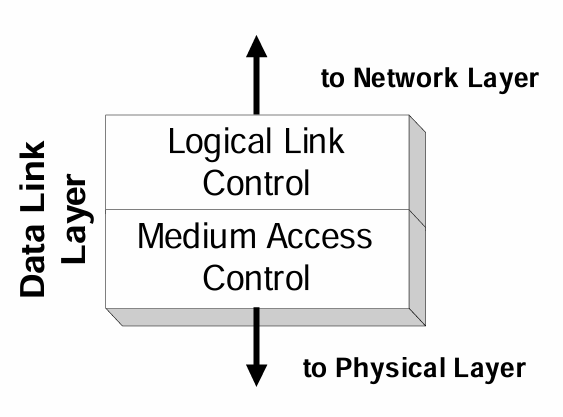
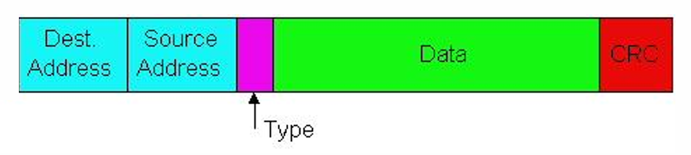
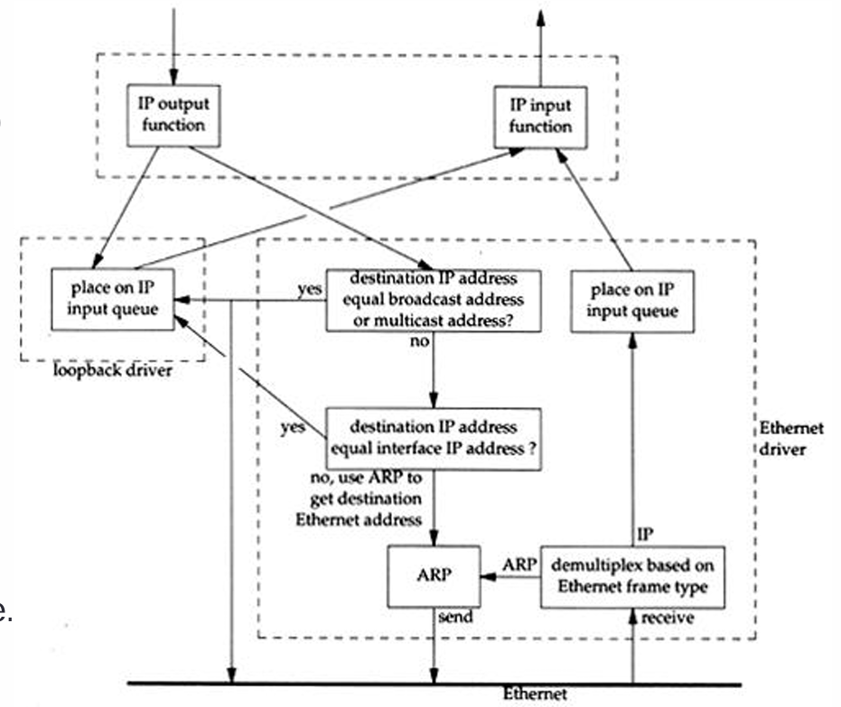
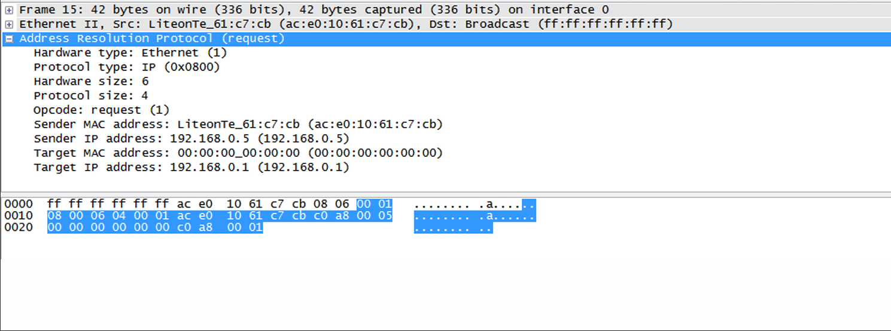
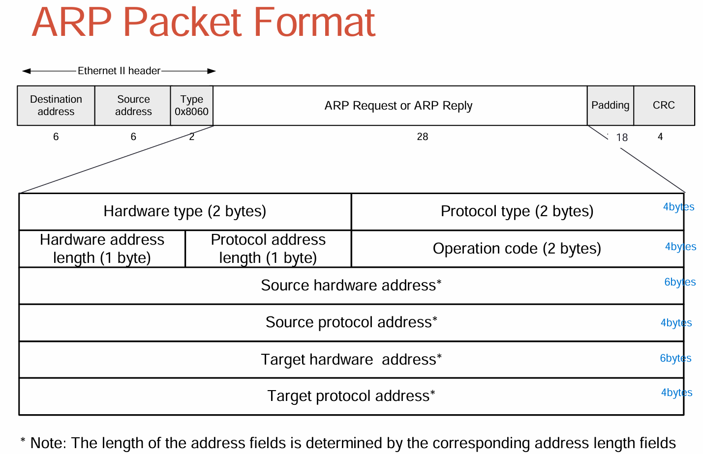
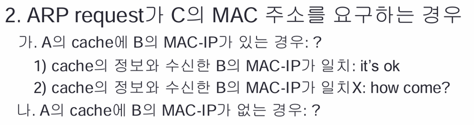
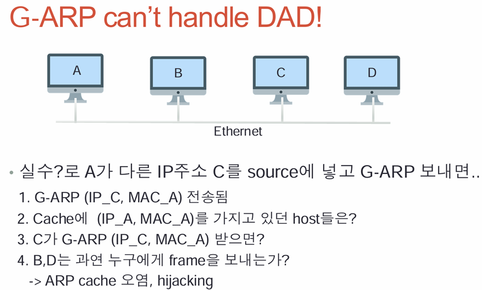
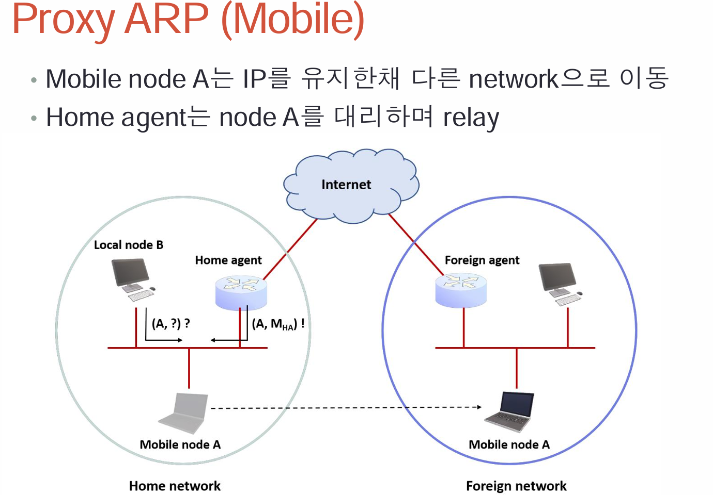

# LLC
- Data Link layer의 윗 부분 

## MAC
- globally unique
- 상위 24비트(octects)는 제조사의 number가 들어감
- promiscuous mode - 모든 걸 수신하는 상태 (wireshark)

- Type - 2bytes
- CRC - 4bytes
- Data Maximum - 1500 bytes, Minimum - 46bytes(24+20+a) + 14bytes(header)+ 4bytes(CRC) = 64bytes
- 64bytes보다 작으면 Collision Dectection이 안되서 46bytes에서 IP header+ Transport Header + 2bytes를 해줘야 함

## Loopback interface
- Broadcast와 Multicast로 들어온 or 보낼 Datagram들은 datagram을 복사해서 하나는 loopback interface로 보내고, 하나는 Ethernet로 나가야 함.

## ARP
- IP 주소만으로는 데이터 전송이 불가하므로, Mac Address를 찾아야함
- Mac address는 ARP(Broadcast)를 통해서 찾음

Ethernet frame의 broadcast는 ffffffffffff지만
ARP packet에서는 Target Mac address를 000000000000으로 한다.

- Ethernet frame은 body에 46bytes가 최소한으로 들어가야 하므로, ARP packet 또한 이 format을 따라야 함. 그러므로 28bytes의 body를 채웠으므로 남은 18bytes를 padding으로 채움.

- QA: ARP table을 내가 request하지 않아도 업데이트 될 수있을까?
- -> G-ARP로 인해 업데이트 가능

- 정적 : OS에서 임의로 설정하는 것 or 명령어로 내가 집어넣는 것
- 동적 : request, reply 

- **Directed broadcast**는 특정 네트워크의 모든 호스트에게 패킷을 전송하는 방식으로, IP 주소는 특정 네트워크의 네트워크 주소에 해당하는 서브넷에서 마지막 주소를 사용하여 마지막에 255를 사용
- 모든 노드는 ARP 테이블을 가지고 있음
- ARP는 1-hop 단위로 이동하기 때문에, 같은 서브넷에 있는 노드들의 mac주소가 중요

## G-ARP 
- 자기 자신의 IP를 broadcast
- 
- 2-2의 경우에는 일단 ARP table을 업데이트 해줘야 함(timer 돌리기)
- MAC address가 바뀌었다면 업데이트(Mac address업데이트 및 timer 돌리기)
- 2-3의 경우에는 A는 이미 B에게 ARP request를 받은 이후의 상황이기 때문에 B의 MAC-IP가 없는게 신뢰가 없으므로 응답을 거부함

- 하드웨어가 변경되었을 때 업데이트를 위해 G-ARP 사용
- **중복된 address**가 있는지 확인해보기 위해서 G-ARP 사용

- 
- 2번으로 인해 MAC이 변경된 줄 알고, ARP 테이블을 갱신
- 3번에서는 response를 A에게 보냄
- 4번에서는 Hijacking을 당해서, B와 D는 C에게 보내도 A로 전송됨

- **G-ARP** 는 **DAD(Duplicate Address Detection**을 하지 못함

## ACD
- address conflict detection
- DAD를 방지하기 위해 source ip를 0.0.0.0 으로 설정 -> ARP probe
- Source IP를 0.0.0.0으로 설정하고 보냈을 때, 응답이 있으면 충돌 없으면 ARP
- reply를 할 수 있는 이유는 MAC으로 통신하기 때문

- ARP Poisoning, Spoofing 을 방지하려면, 라우터가 주기적으로 ARP request를 반복하여 A,C가 랜덤하게 업데이트 됨.
- 라우터는 A와 C에게 번갈아가면서 보내게 되는데, 결국 C가 피해를 받음.

## Proxy ARP
- source에서 destination IP를 적어서 데이터를 보낼 때, 같은 subnet에 없으면 라우터가 자신의 MAC주소를 매핑하여 response

# Proxy ARP

- node B가 node A의 Mac주소를 물어봤는데, 다른 서브넷에 있으니까 Proxy ARP를 통해서 Home agent가 자신의 node를 말해줌으로써 node A를 대리함.

## Directed ARP
- unicast로 요청
- ARP Packet의 request Target Mac 주소는 0000000... 으로 항상 보냄

## ARP Vulnerability
- ARP의 request와 reply는 오염될 수 있음.
- ARP is stateless. ARP reply는 request 없이도 받을 수 있음
- - G-ARP를 통해서 request없이 reply를 받거나 안 받을 수 있음
- ARP table에 있는 node 였으면, ARP protocol을 받으면 업데이트 되어야 함