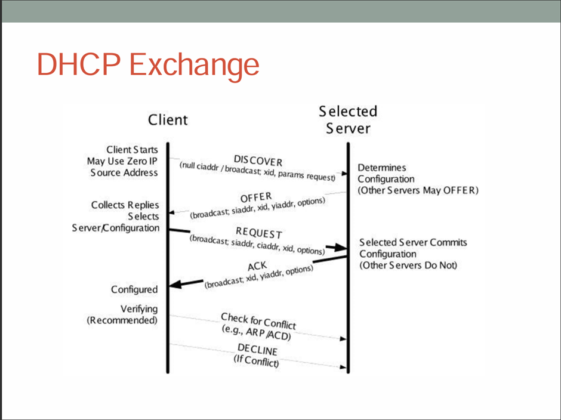
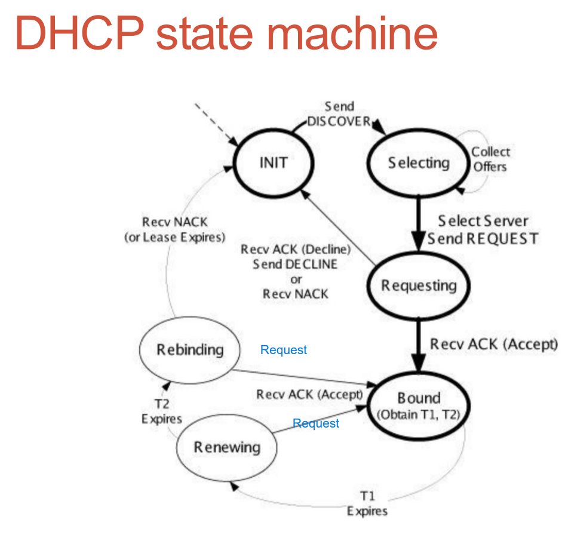

## DHCP
    주소를 어떻게 할당하느냐?
    => 사용자에게 타임 리미트를 주고 ip 및 네트워크 설정(서브넷 마스크, 게이트웨이, DNS) 할당해서, 시간 연장 요청이 없으면 버림
    네트워크 설정 같은 부분은 원래 할당되어 있던 정보를 클라이언트한테 알려주는 것

    T0 = 1hour을 준다면 
    30분이 지나고 나면 T1만큼 request를 함.
    T1 = 0.5 T0 = renew
    T1에 대한 ack를 못 받았고, time over가 다가왔을 때 T2를 request
    T2 = 7/8 T0 = renew
    두번 물어보고 give up
    Give up 이후에는 다시 Discover부터 시작함

Discover, Offer, Request, Ack 과정으로 진행됨
4단계는 기본적으로 전부 broadcast로 진행됨
하지만 이미 IP를 아는 상태라면 unicast로 대답 및 요청도 가능

1. Discover : DHCP 서버 탐색
2. Offer : 서버에서 사용가능한 ip 및 옵션 제안
3. Request : 해당 IP 선택할거라고 broadcast
4. ACK : 최종 승인

QA: Request가 해당 IP를 선택한다고 하는 점은 ACD Probe와 유사하지않나?? 하지만 뒤에서 또 충돌 검사를 위해 ACD를 하는 이유가 궁금함
-> Request는 이거 사용한다? 라고 확정한거고, ACD Probe는 쓰기로 했으니까 충돌 확인해보는 느낌. 이후 ACD announcement를 통해 충돌 검사도 했으니까 진짜 쓴다!

## DHCP 취약점
    DHCP Exhaustion attack
    DHCP 서버의 IP 주소 풀을 고갈시켜서 정상 사용자들이 IP 못 받게 하는 방식 (Dos)

    DHCP MITM attack
    내가 DHCP 서버인척 해서 DNS server를 나로 설정
    => 특정 서버 IP를 요청했을 때, 내가 원하는 server IP를 줌으로써 이상한 곳으로 하이재킹해버림 or gateway를 나로 설정해서 모든 패킷 spooping 해버림

