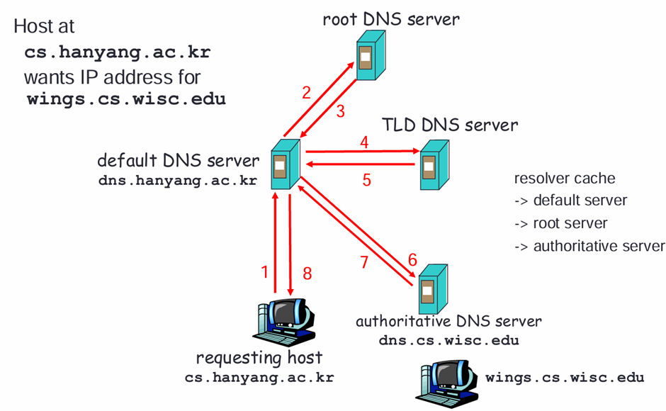

Domain Name System
-	Properties of DNS
-	Hierarchical 한 구조로 파일들을 정리할 수 있게 나누자
-	Root 아래 계층에 존재하는 server를 Zone or Authoritative server이라고 함
-	Hierarchy of DNS server
-	Root 존재하지만, unnamed-root server(절대 꺼지면 안되니까 hardwired)
-	Top level domain(TLD) server – Root 바로 밑에 있는 servers 중 몇 server
-	DNS server와 소통할 수 있도록 하는 resolver software
	 
-	Resolver는 cash에 있는지 확인해보고, 없으면 server로 감
-	거꾸로, IP주소로 hostname을 찾는 것이 가능(Reverse lookups)

