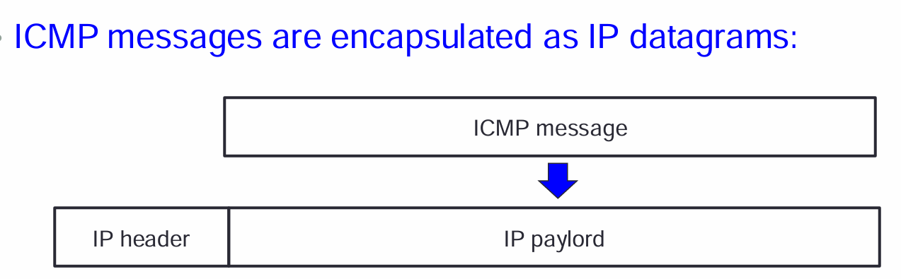
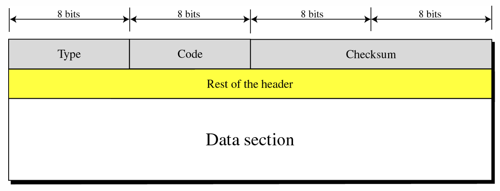
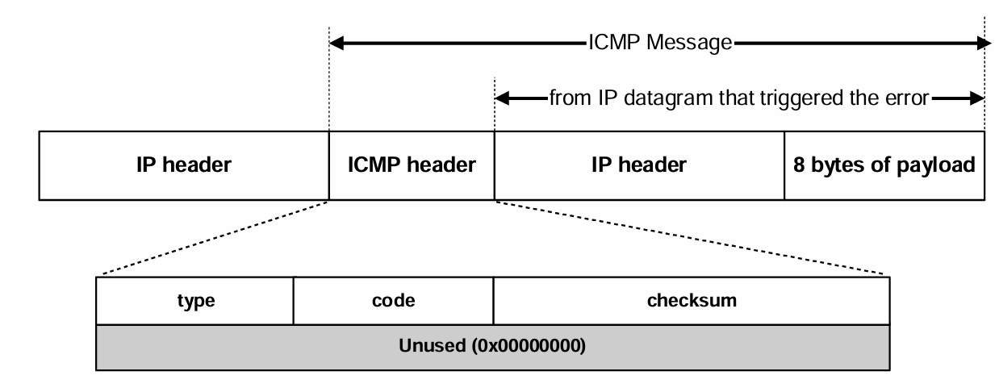
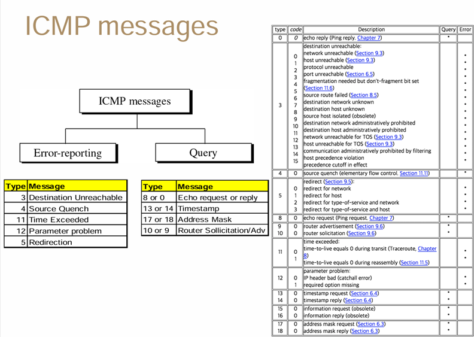
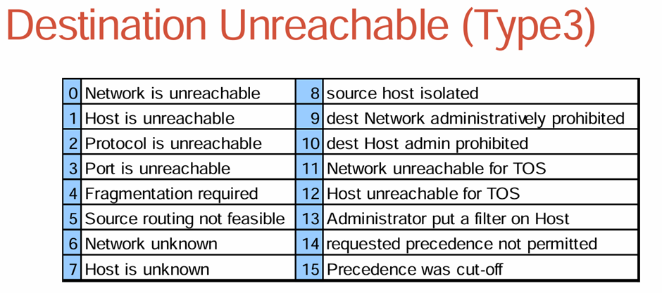
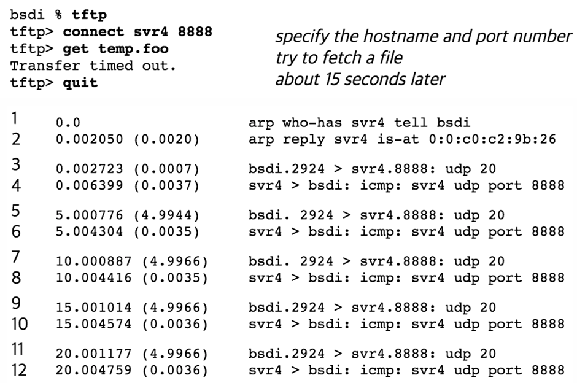
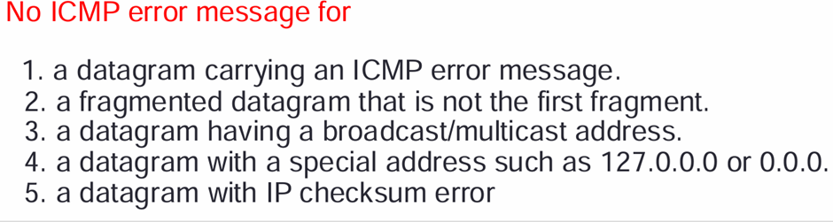
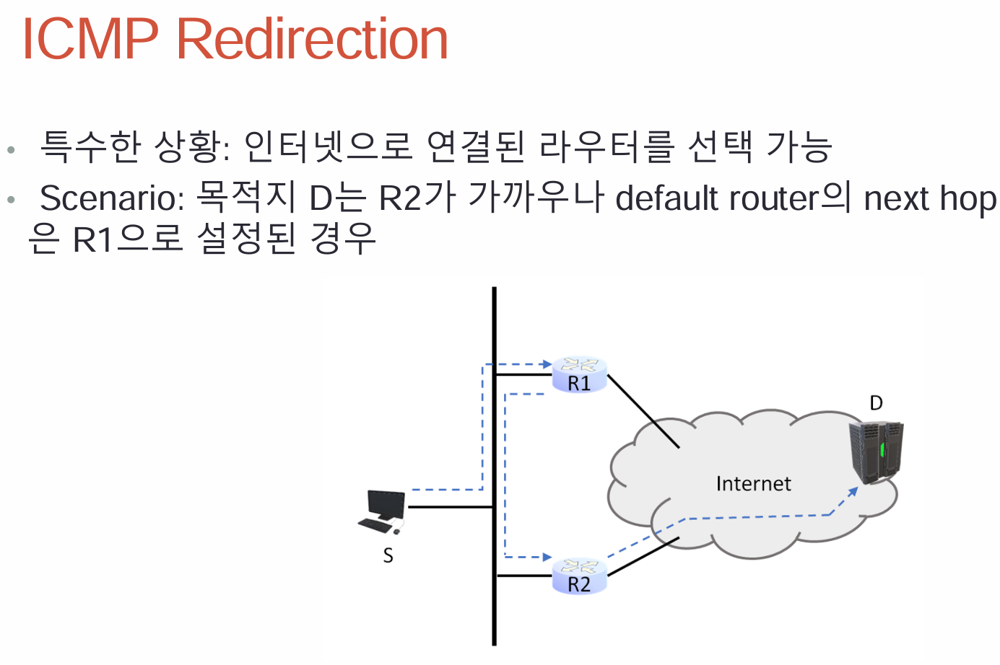
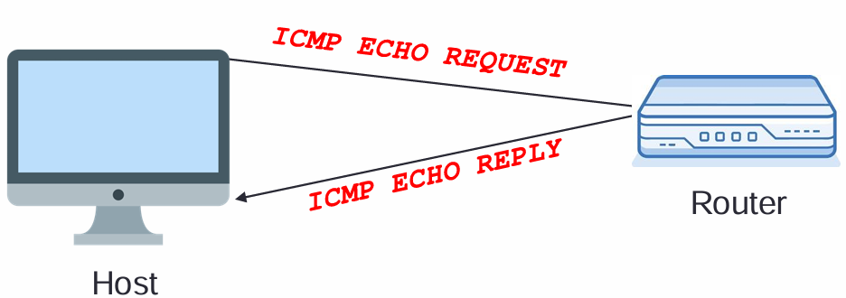
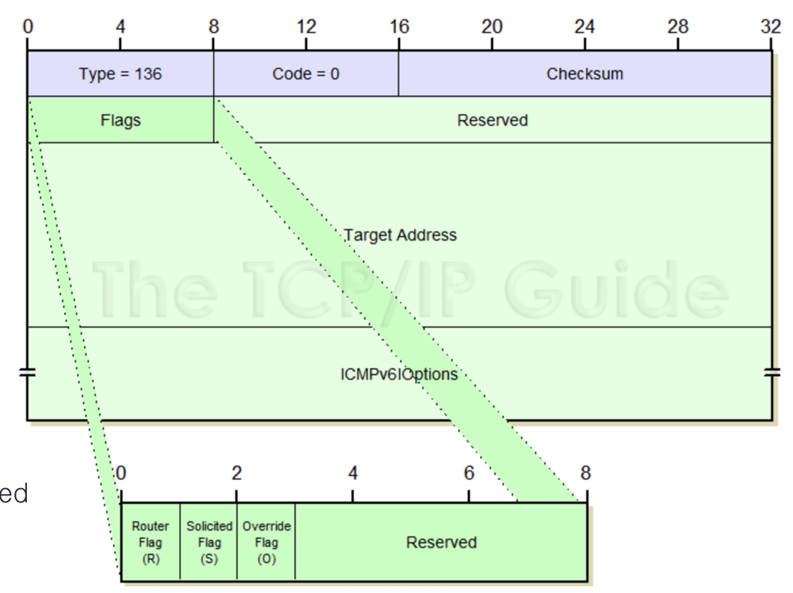

## ICMP
- Error / State Reporting
# Service
- 최소한의 편의성을 위한 3.5 layer 느낌
- ICMP는 router가 메시지를 discard 했을 때, discard 한 사실을 source에게 말해줌
- 간단한 쿼리
- 

# ICMP
- layer마다 오류가 발생할 수 있는데, 그때마다 ICMP를 전송
- ICMP 메시지들은 IP의 paylord(내용)부분에 들어감
- 

- IP header로 캡슐화를 하기 때문에, layer3 X
    추가적인 8bytes가 있는데, L4의 헤더가 포함되어있음
- 주로 IP에서 문제 발생(시간 초과, 목적지에 도착X)
- 에러가 발생했다고 말함과 동시에 에러 정보들을 같이 보냄
- 만약 ICMP가 문제 패킷일 때는 다시 ICMP를 보내지 않음

## ICMP format

- Type 1 byte
- Code 1 byte 같은 type에 대한 여러가지 case
- Checksum 2 bytes
- 각각의 ICMP message 들은 최소 8 bytes 
- - 8bytes는 transport layer의 header로, layer 4의 데이터도 가져옴

# Data Section
- Error Messages : 에러가 발생한 원래 패킷을 찾기위한 정보 포함(IP header와 IP paylord의 첫 8 바이트)
- Query Messages : query의 type에 따라 추가적인 정보 제공

## ICMP messages

# Query
- 대부분 echo request or reply 용도로 사용 됨

# Error-reporting 
- Type 3가 가장 많은 에러비율을 차지, Destination unreachable
- Source Quench 는 너무 빨리 라우터에게 보내고 있으니까, 천천히 보내
- Time exceeded 는 TTL이 0이 되어버린 것
- Redirection은 special한 cast로, 인터넷으로 연결된 라우터를 선택 가능(Router는 input 과 outgoing interface가 같은 것을 싫어함)

## Destination Unreachable

# network is unreachable
- 잘못된 주소가 사용돼서 routing table에 없는 상태
# Host is unreachable
- Arp response가 없음
# Protocol is unreachable
- protocol field 부분이 잘못되었음 (TCP=6 UDP=17)
# Port is unreachable
- Socket이 닫혀있거나, process가 죽은 상태

- ICMP 보냈는데 왜 자꾸 packet을 보내?
- Router가 application layer까지 데이터를 올려보내지 않고 버린 것 왜? socket에 안 올라왔잖아. -> port unreachable
# Fragmentation required
- 데이터 크기가 크지만, 조각을 자르지 말라고 해서 발생
# Source routing not feasible
- 라우팅이 불가능한 경우(장비가 고장났을 경우)

2,3번의 경우 End user에서만 발생할 수 있음
나머진 모두 router에서 발생
-> router가 packet 전송을 막는 모든 문제를 감지할 수는 없음

# No Error Message

- 1은 ICMP error Message에 대한 ICMP를 보내지 않음(ping은 request고 error가 아님)
- 2번의 경우 첫 번째 조각에 대해서 오류 메시지를 생성했을 테니까, 다른 조각에 대해서는 생성하지 않음
- 3번의 경우 , 여러 수신자에게 데이터 그램이 전달되므로 ICMP를 생성시 네트워크 트래픽 발생
- 4번의 경우, 특정 네트워크용도로 사용하는 주소는 주로 내부 or 네트워크 설정 과정에서 사용되므로 보내도 의미 없을 수 있음
- 5번의 경우에는 왜? 라고 생각할 수 있는데, Source가 잘못한 게 아니라서

# ICMP Redirection
- 
- R1이 Redirection을 요청

# ICMP Query Message
- Query의 역할 중 Echo request and reply만 알면 된다.
- ping은 kernel을 통해 직접 다뤄지고, 호스트가 echo request를 하면 router가 echo reply를 해줌.

## Finding network path
# PMTU Discovery
- datagram의 크기를 줄여나가면서 보낼 수 있는 최고의 크기로 보냄
- DF를 설정해야 함
- IPv6의 경우 fragment가 없으니까, 최소 MTU가 존재

# Ping
- 도달 가능 여부를 알기 위해 ICMP Echo Request를 보내고, 상대방이 Reply 하는지 확인

# Traceroute
- TTL을 키워나가면서 상대 router IP에 접근한 다음, TTL 0이 되는 순간 ICMP를 통해 router의 IP를 알아냄으로써 어떤 router 거치는 지 확인 

# ICMPv6
- ICMPv4 의 에러 메시지와, query request/reply 유지
- ICMP4 ARP와 IGMP 역할을 대체
- NS,NA로 ARP 대체

# 차이점
- Fragmentation에 사라지면서 MTU보다 큰 데이터그램 **무조건** 버림
- - Packet too big 에러, Multicast도 보내줌
- ARP를 ND로 대체

# ICMPv6 NA format
- 
- R = 1 

# ICMPv6 NS format
- flag 가 없음 