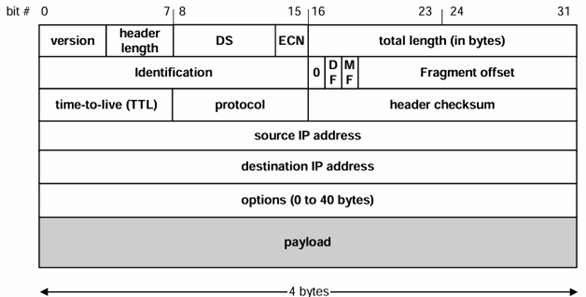
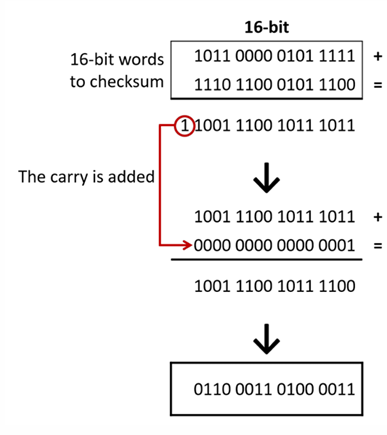
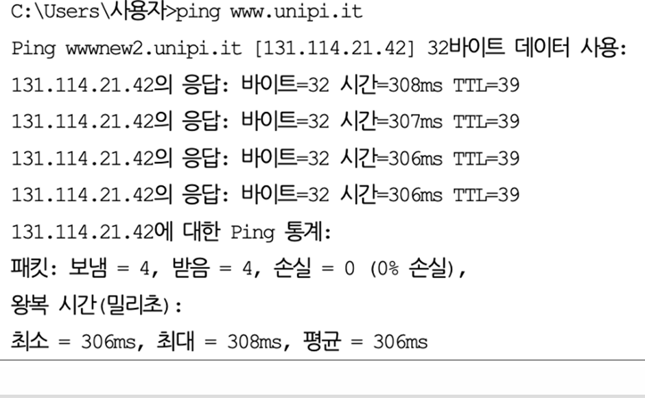
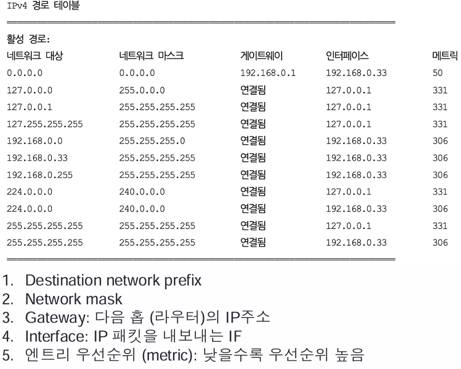

## IP

# Basic knowledge 
- 자주 쓰지 않는 router는 필요없지 않나? 라고 생각할지 모르지만 없어서는 안됌
- Site - local 은 내부에서의 연결
- Link - local 은 1-hop 의 연결
- Core Router라고 80만개의 interface, 즉 모든 주소를 가지고 있는 router가 존재
- Router은 모르는 IP가 왔을 때 대처하기위해, default gateway를 가지고 있음

# IP의 역할
- 다른 technology / layer에 대해서 연결해주는 것
- forwarding 해주는 것

# Connectionless
- Connectionless - 중간에서 패킷을 Control하지 않음
- Unreliable - 패킷을 잃어버릴 수 있음
- Best effort - 최선을 다하지만, 보장하지 않음

# Consequences
- 패킷이 순서대로 전달되지 않을 수 있고, 중복된 패킷을 주거나 잃어버릴 수 있음
- 상위 layer에서 이러한 점을 보완하기위해 방법을 찾아야함

# IP Service
- **Unicast**는 one-to-one
- **Broadcast**는 one-to-all
- **Multicast**는 one-to-several
- Multicast는 다른 protocol의 도움을 받아야 함

# IP Header

- 위에서 destination 까지는 20bytes(고정), option이 최대 40bytes
- Header Size = 최대 60bytes
- Total length = 20bytes + payload = 최대 2^16bytes

# Fields 설명
- Version(4bits) : 4(IPv4) , 6(IPv6)
- Header length(4vits) : IP header의 길이를 4byte 단위로 나타내는 필드로, 값이 5면 20bytes를 나타냄
- DS/ECN(1byte)
- Total length : 최대 2^16 이지만, MTU가 존재해서 꽉 채워서 사용하지 않음
- Identification : 분리된 데이터들이 같은 데이터 인지 알수 있게 함
- DF : Don't fragment라는 의미로, 1이면 분리하지 마
- MF : More fragment라는 의미로, 1이면 뒤에 분리된 packet이 있다는 의미로, 가장 마지막 패킷은 0
- Fragment offset : 분리된 packet의 시작 위치
- TTL : 사이클 도는 것을 방지하는 용도 및 hop count
- Protocol : TCP, UDP 확인 용 TCP - 6, UDP - 17
- Checksum : header의 값들이 변경될 수 있으니까 확인해보는 절차

# TTL
- 라우터가 패킷을 받으면 가장 먼저 TTL update(-1)를 해주고, 0이면 버림
- - 내가 받자마자 -1을 하고, 0이면 버림, host에서는 TTL값이 0이어도 받을 수 있음 
- router만 TTL 값을 -1 함
- 버릴 때 ICMP를 통해 시간 초과되었다는 메시지를 전송

- ping을 보냈는데, 응답으로 TTL=39가 왔음. TTL이 25정도 줄어있다는 사실을 알 수 있으며, 25hop을 통해서 전달되었다는 사실도 알 수 있음

# checksum

# Routing table

- 127.0.0.1 은 loop back interface
- 젤 위가 default gateway 로, network mask가 0.0.0.0
- 연결됨은 해당 네트워크가 로컬 네트워크와 이미 연결되어 있음을 나타냄. router를 통하지 않고 직접 전송

- ip spoofing -> ingress filtering으로 방지 가능
