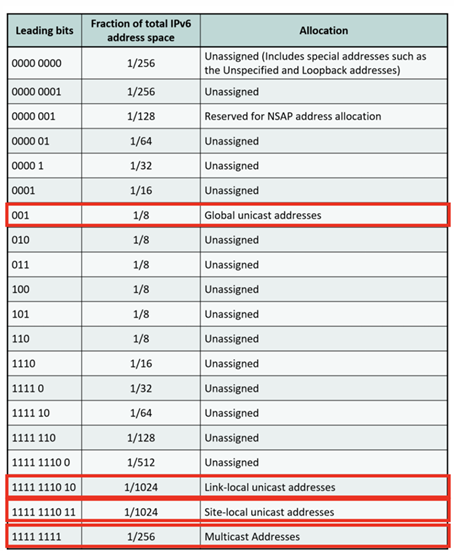
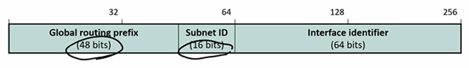
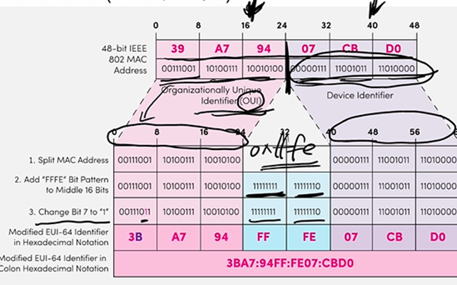
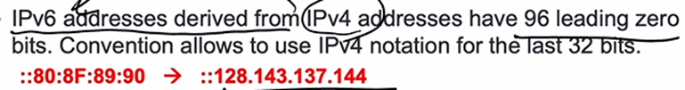
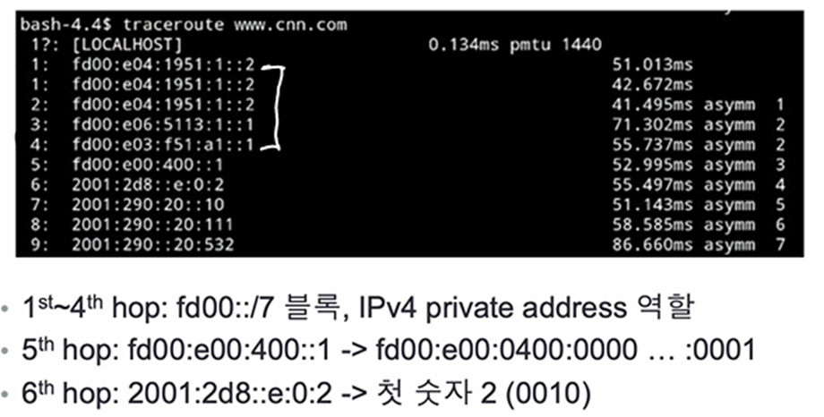
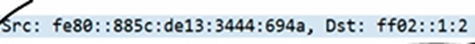
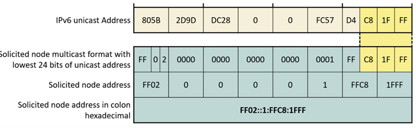
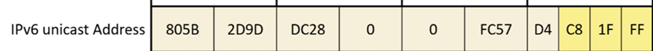
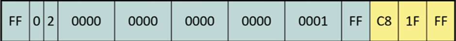
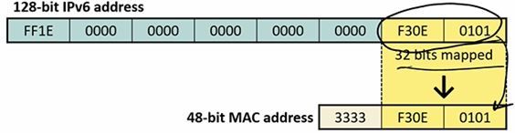

# IPv4 주소 고갈 대응 방법
- NAT사용(중,단기적 임시용)
- IPv6 (장기적 영구용)

### IPv6
- 128bits의 주소 길이를 가짐
## 주소 종류
# Unicast
- Global은 001 로 시작함. 전체 주소의 1/8
- Link-local은 1-hop으로 갈 수 있는 traffic으로 1111 1110 10 으로 시작함. 전체 주소의 1/1024
- Site-local은 하나의 site 내에서 이동하는 traffic으로 1111 1110 11으로 시작함. 전체 주소의 1/1024

# Multicast
- broadcast 포함
# Anycast
- Unicast의 형태
- IP같은 host 여러 명에게 보내서 아무나 받도록 가능
- DNS 서버는 Anycast 를 통해서 배포됨
- 여러 서비스가 동일한 서비스를 제공할 때, Anycast로 트래픽을 분산시킴으로써 loadbalancing 유지
- anycast는 클라이언트가 request를 보낼 때, router가 경로를 지정하는 방식

# Global Unicast

- 네트워크 -> 서브넷 -> 호스트 인터페이스로 전달
- 고정된 128bits의 크기
- Routing prefix는 48bits로, global unicast는 001으로 시작하며 1/8의 주소 공간을 가진다고 함. 001+2^45 개의 네트워크를 가짐
- Mac주소로 Interface ID를 Mapping 하는 방법이 존재

- Mac주소가 있으면, 앞에 3바이트 뒤에 3바이트를 구분하고, 중간에 fffe를 더해준다. 이후 앞에서 7번째 bit를 1로 변경
- 왜 이렇게 하는지 생각해볼 수 있지만, IPv6는 ARP가 없기 때문
- Mac주소를 통해서 IP를 얻을 수 있는데, 역으로는 가능한가?

# IP Address
- IPv6는 128bits를 사용하므로, 8개의 16bits Integers로 작성
- Leading Zero는 압축
- 0:0이 연속으로 오면 ::로 압축 가능
- IPv6 주소를 IPv4로 변환 가능

- 앞에 leading zero 96개를 추가하고, 10진수로 변환

# Example
- SK의 LET망 확인. www.cnn.com까지 가는 과정

- 처음 Local Host를 뜻하는 주소는 ::1로, loop back 주소
- 첫 4개는 사설주소이고, 6번째는 2001:~~ 이다. 첫 숫자가 2(001)이 나왔다는 것은 global unicast라는 의미

1111 1110 10 – link local
1111 1111 11 – site local
1111 1111 – multicast

- Src는 1111 1110 1000 0000 이므로 link local 임을 알 수 있고,
- Dst는 1111 1111 0000 0010 이므로 multicast 임을 알 수 있음

## Multicast
- IPv4에서는 destination ID를 사용할 때, 224.0.0.1과 224.0.0.2를 중요하게 사용하는데, IPv6도 비슷함
- ff02::1 (모든 IPv6 인터페이스)
- ff02::2 (모든 IPv6 라우터 인터페이스)

## SNM
- IPv6에서 중요한 Multicast address인 SNM(Solicited-node multicast)는 ARP를 대용하기 위한 address
- ND를 통해서 IPv6 Multicast를 보냄

- 첫 FF는 multicast를 뜻함
- 2는 link local, 1은 node local, 14는 global
- Unicast를 통해서 전달하는데, 타겟 인터페이스만 SNM을 받게 됨
- SNM을 받는 라우터는 일반 IP/MAC과 Multicast용 IP/MAC을 따로 가짐

- 일반 IP는 알고 일반 MAC을 모르는 상황에서 Multicast용으로 보낼 수 있음
- 일반 IP를 통해 Multicast용 IP를 추론할 수 있고, Multicast용 IP로 Multicast 용 MAC 주소를 추론할 수 있음

- Unicast의 마지막 3자리(24bit)를 가져오고, 고정된 부분을 더함

- Multicast IP로 Mac 주소를 mapping하기 위해서 3333 과 마지막 32bit를 더함

# Special Address
- ::은 this machine
- ::1은 loopback 주소를 나타냄

## IPv6 Multicast address
