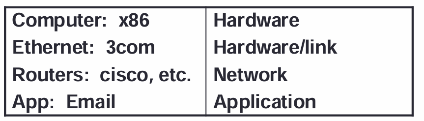
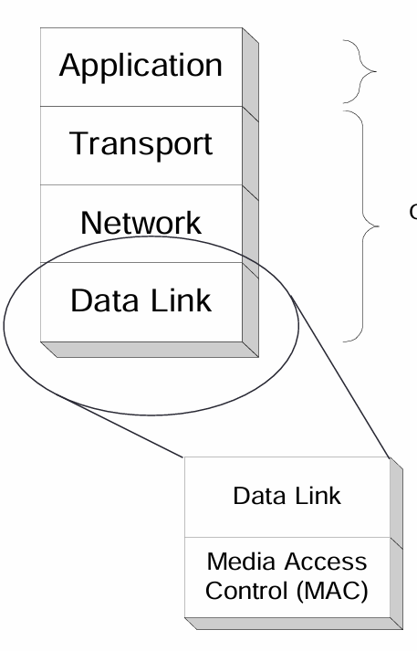

## Layering
- **Protocol**은 end users가 연락할 수 있도록 하는 rule으로, 여러 기기들이 상호 운용 가능하도록 만드는 것이 주 목적.
- **IP**은 네트워크 경계를 넘어 데이터그램을 전달하기 위한 통신 프로토콜
- - routing function은 internet networking의 필수 요소 
- **Protocol**은 모든 layer에서 존재함.(hardware & software)

# Protocol 

- Layer 4,5 는 software protocol, 나머지는 hardware protocol
- Syntax : data encoding, language
- Semantics : Error handling, termination, ordering of request

| OSI 7계층         | TCP/IP 계층(4/5계층 관점)                | 핵심 기능/포인트                                       | 대표 예시                                                  |
|-------------------|------------------------------------------|--------------------------------------------------------|-----------------------------------------------------------|
| 7. Application    | Application                              | 애플리케이션별 프로토콜(요청/응답 의미, 포맷)          | HTTP/HTTPS, DNS, SMTP, FTP, SSH, RTP, QUIC(전송 포함)     |
| 6. Presentation   | (응용 계층 안/위에서 구현되는 경우 많음) | 데이터 표현/변환, 직렬화, 압축, **암호화**             | TLS(암호화), JSON/Protobuf, MIME, 문자/코드 변환          |
| 5. Session        | (응용/라이브러리/프레임워크)             | 세션 관리, 동기화, 체크포인트/복구                     | TLS 세션, gRPC 세션, RTSP 세션                            |
| 4. Transport      | Transport                                 | 종단 간 전달, 연결 관리, 오류/흐름/혼잡 제어(프로토콜별 상이) | **TCP**(연결·신뢰성), **UDP**(비연결) |
| 3. Network        | Internet                                  | **호스트 간** 패킷 전달, 라우팅, 주소 지정             | **IP**(IPv4/IPv6), ICMP                 |
| 2. Data Link      | Link                                      | **링크(이웃 노드)** 프레이밍, 매체 접근 제어, 오류 검출 | **이더넷**(MAC), Wi-Fi(802.11), PPP, ARP*                 |
| 1. Physical       | Physical (TCP/IP 설명에선 Link에 포함되기도) | 비트 전송(전기/광/무선), 커넥터/주파수/부호화          | UTP, 광섬유, RF, 1000BASE-T, OFDM                         |

\* ARP는 흔히 2.5계층(링크와 네트워크 사이)로 설명됩니다.

## Interface 
- **interface** 는 네트워크에서 통신을 가능하게 하는 장치 또는 layer 간의 연결 점. OS에서는 기본적으로 여러 interface에 대한 protocol rules 을 가지고 있음. interface(Ethernet에서 접속하는 protocol과 wifi protocol)가 다르니까 그걸 OS가 조절 

- Layer5~Layer3까지는 다른 게 없고 Link layer에서부터 다른 interface로 인한 차이 발생.
- Header가 계속 붙으면서, 데이터 위에 쌓이고, 서로 간섭하지 않음.

**Layer**을 나누는 이유는 복잡성을 줄이고 각 계층이 독립적으로 기능을 수행하도록 하기 위함. 각 계층은 서로 다른 작업을 수행하며, 다른 계층의 정보를 직접적으로 간섭할 수 없도록 설계되어있음. 예를 들어, 라우터는 network layer 까지만 데이터를 확인하고 처리함.
-> communication architecture or protocol suite

## Layered Communications
- 실제로는 아래의 layer을 통해서 연락하지만, 상대방 입장에서는 같은 layer와 연락하는 느낌을 줌

- **Link layer** - device driver와 Network Interface card 포함
- **Network layer** - packet 움직임 control
- **Transport layer** - 신뢰할 수 있는 데이터 흐름
- **Application layer** - application의 detail control

# TCP/IP Protocol Suite
- TCP/IP Protocol Suite는 인터넷의 protocol architecture
- End host는 all layer을 implement
- Router only have Data Link(Link,physical) and Network layer
- **LAN** 상에서는 Data Link layer에 Sublayer로 Media Access Control layer을 가짐 

**PDU**는 해당 계층의 header를 포함한 크기
**MTU**는 L3에서 보낼 수 있는 데이터의 최대 크기
## Functions of Layer
# Data Link Layer - Reliable frame transfer
- Framing
- Media access control
- error checking (CRC)
# Network Layer - Move packets 
- Routing
- addressing
# Transport Layer - delivery data
- Connection establish/termination
- error control
- flow control

# Application Layer - 많은 기능
- specific한 기능

## Layered Communication
- 1 대 1로 연락하는 것 같은 착각

## Service Access Points
- 상위layer 와 하위layer 간의 상호작용위한 point or interface
## PDU와 Demultiplexing
- **PDU**는 해당 layer에서 보내는 실질적인 메시지로(header + paylord), 각 계층에서 주고받는 데이터의 단위를 뜻함.
- A가 B한테 데이터를 보낼 때, 내려가면서 header를 추가적으로 더하면서 내려감. 
- ex) IP layer에서는 header 3개(application,transport,IP) + data 
- **Demultiplexing** 은 수신된 데이터에서 각 계층의 헤더를 분석하고, 해당 계층의 프로토콜에 따라 데이터를 사위 계층으로 전달하는 과정. 각 계층의 헤더에는 어떤 프로토콜을 사용할지 명시된 필드가 있어서, 이를 통해 데이터가 적절하게 처리됨.

