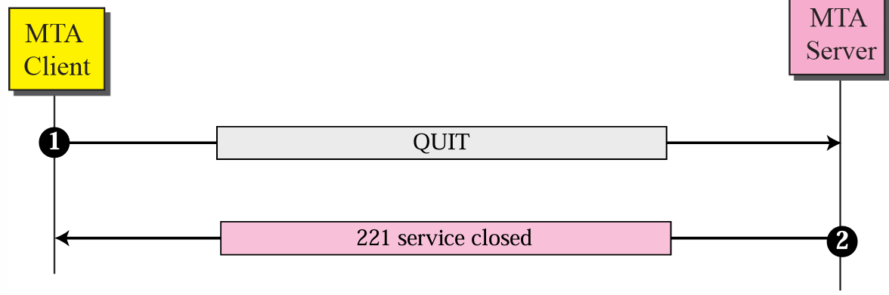
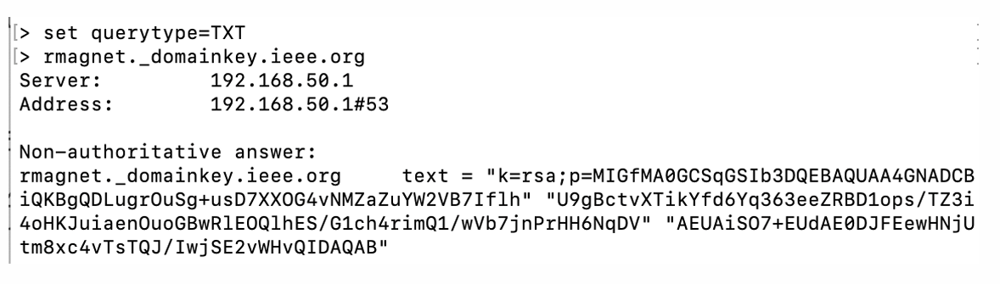

# SMTP Overview
- 우편 배달과 유사
- 편지를 봉투에 넣음 -> 수신자의 이름과 주소 작성 -> 우체국에 맡김 -> 우체국끼리 전달망을 통해 이송 -> 수신자의 우편함에 전달 -> 수신자가 우편함에서 인출
- rudals4349@hanyang.ac.kr이 있으면, rudals4349는 ID, hanyang.ac.kr은 Domain
- 
- 우선 순위가 높은 곳으로 exchange 될 것

# Email
- 이메일 발송 - 발신자의 Domain을 책임진 MX(메일 서버)에게 발송 요청
- MX의 queue에 들어감
- MX의 queue에서 발송 시, 수신자 이메일의 도메인 이름 추출 후 MX 검색
- 수신 Domain의 MX 서버에 TCP 연결
- SMTP 프로토콜로 발신 MX 와 수신 MX 사이에 메일 전달

- 이메일 수신 - 수신 Domain MX가 수신자의 이메일에 해당 메일을 넣음
- 수신자가 꺼낼 때 까지 메일 존재
- 수신자는 pull 프로토콜을 통해 메일 수신(POP3,IMAP,HTTP)

- 

## SMTP

# Main Components
- User Agents(UA): 사용자의 이메일 메시지 준비 지원
- Mail Transfer Agent(MTA): 이메일을 인터넷을 통해 전송하는 역할로, MX에서 MX로 전달
- 
- Alice는 UA를 통해 메일 준비 후, MTA client로 메일을 보냄.
- MTA client는 이메일을 spool에 두고 전송 (Qestion: spool에는 저장되는가? 사라지는가?)
- Bob의 MX는 MTA 서버를 통해 메시지를 수신하고, 이를 저장
- Bob은 UA를 통해 MX에 접속하고, 이메일 확인 후 MTA -> UA로 전달

# Command and response
- 
- 

# Message transfer
- 
- 위의 사진은 보안적인 문제가 존재(송신자 및 수신자에 대한 인증X, 암호화X)

- Connection establishment
- 
- Connection termination
- 

# SMTP 한계
- 메시지를 7it 아스키코드 형식으로 전달
- Authentication 메커니즘이 없음
- 메시지가 암호화되지 않음

# MIME(SMTP extension)
- 아스키 코드가 아닌 데이터를 아스키 코드로 변환하고 client MTA에 전송
- MIME를 통해 다시 원래의 아스키 코드가 아닌 데이터로 변환되서 전송
- 

# MIME Header
- 

# Base64 Encoding
- 24bit block을 각각 6bit block으로 나눈 뒤 base-64 converter로 변환
- 
- 
- Non-ASCII Code가 두 글자면, 아래의 사진처럼 = a b 로 나눔
- 

## Message Access Agent
- Message 를 보낼 때, 1st,2nd stage는 SMTP(push)이고, 3rd stage는 pull 이므로, SMTP가 아님
- 3rd stage에서는 Message Access Agent(POP3,IMAP4,HTTP) 사용
# POP3
- mail을 가져갈 수 있지만, 가져가면 사라짐(다른 곳에서 access불가)
# Internet Mail Access Protocol
- mail을 가져가도, mail이 사라지지 않음
# Web-based
- 

## ESMTP
- SMTP의 문제점들 극복하며, EHLO를 통해 handshaking 하여 MX ESMTP 지원 여부 확인
# Header
- 
- 
- - 밑에서부터 올라가는 방식
- - Received from localhost에서 MX로 보냄
- - 상대방의 MX에 보내고, MX에서 수신한 서버로 전달
- - 
- - X- 는 standard header가 아니라는 의미
- Return-Path : MAIL FROM을 통해 발신 MX에서 입력한 사용자의 이메일 주소 
- Authentication-Results : 수신측 서버가 수행한 다양한 메일 인증 결과
- - 
- - Received-SPF : 발송자 주소 위조에 쓰임 -> 검사를 위한 필드

## Email Security
# SPF : 주어진 도메인의 이메일 발송 자격이 있는 서버인지 확인
- 발신 자격 검사를 통한 스팸 메일 필터링
- 각 도메인은 DNS에 TXT RR 등록(해당 도메인에서 이메일을 보낼 수 있는 IP)
- 재귀적(recursive)으로 IP주소가 얻어질 때까지 TXT query가 필요할 수 있음
- 
- IP들이 나오고, include: "server"에서 server에 들어가면 또 다른 하위 ip들이 존재
- ~all: 수신하지만 실패표시
- -all: 수신 거부
- +all: 무조건 수신
- 모든 경유 메일 서버에서 SPF 검사 가능하므로 Authentication-Results 헤더에 추가
# DKIM: 메일 내용이 변조되었는지 확인
- 주요 헤더(From,To,Date,Subject)와 body 일부/전체를 Hash하고, Hashing 결과를 암호화해서 DKIM-Signature 헤더 필드에 추가
- 서명에 사용된 private key의 public key는 DNS에 등록
- 
- public key는 DNS에서 TXT query를 통해 알 수 있음
- 서명 복호화 후, 메일의 해당 부분 Hash값 비교
- 
- 
- 메시지를 암호화 하는 것이 아니라, Hash 한 부분을 비교함으로써 변조 확인
# DMARC: 주어진 도메인에서 수신된 의심스러운 메일을 어떻게 처리할 것 인가?
- SPF/DKIM에 의해 의심스러운 것으로 분류된 메일 처리
- p=none : 인증 실패한 메일을 특별히 처리하지 않고, report 작성
- p=quarantine : 실패한 메일을 스팸 폴더로 이동
- p=reject : 실패한 메일을 수신하지 않고 반송
- DMARC 정책은 도메인 DNS에 _dmarc라는 서브도메인을 추가하여 설정(_dmarc.example.com)
- 서브 도메인에도 Subdomain policy 지정 가능
- rua = 보고서를 보내줄 URI

- "adkim ="
- - Strict(s)는 도메인 값과 발신자 도메인 이름이 정확히 일치
- - Relaxed(r)은 d의 하위 도메인과 일치해도 됨
- - 
- "aspf ="
- - s는 From 헤더 값과 MAIL FROM 도메인 이름이 정확히 일치
- - r은 From 헤더 값의 하위 도메인과 일치해도 됨
- - 

