## TCP
# Challenges
- drop packets
- delay packets
- deliver packets out of order
- replicate pacakets
- corrupt packets

# Service
- Reliable delivery
- - IP가 packet을 읽어버리는 경우
- In-order delivery
- - IP가 순서 잘못보내주면, TCP가 reordering한 후 application에게 전달
- Flow Control
- - 수신 application이 받을 수 있는 만큼만 배달
- Byte-stream
- - 데이터는 bytes의 연속
- Connection oriented
- - 데이터 전송관리
- - 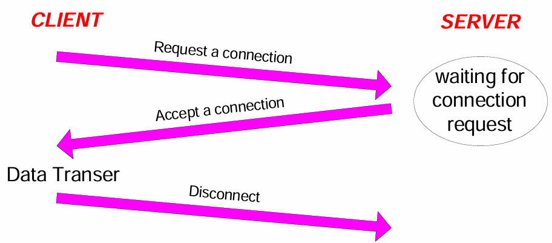
- - connection 생성 후 data transfer

# Reliable Delivery
- Checksum
- Sequence numbers
- Retransmission
- - retransmit lost or corrupted data
- - Timeout based
- - Fast retransmit 

# TCP Header
- 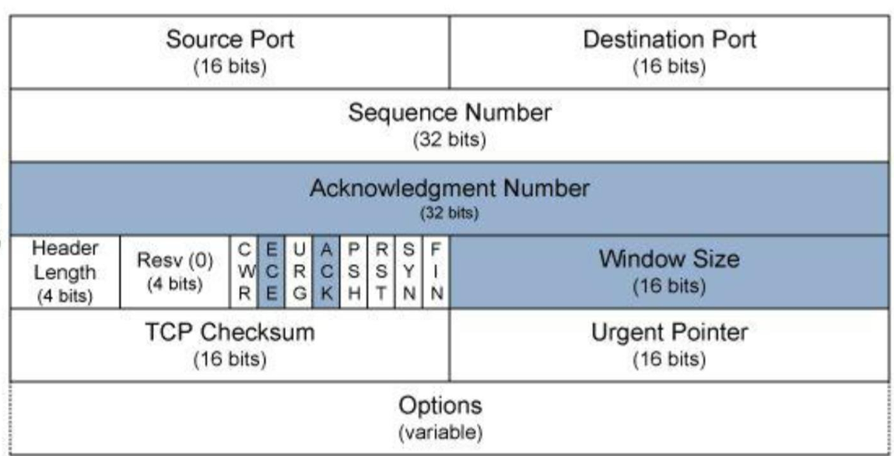
- Sequnce number은 Starting number of data(byte offset)
- Ack는 "What's next?"
- HdrlLen = 5 : if no options
- Must Be Zero 6bits
- Window Size를 통해서 flow controll
- 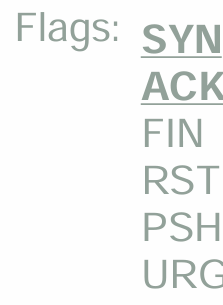
- 총 20bytes

- 
# ISN
- Initial Sequence Number은 TCP 연결에서 처음 전송되는 Number
- ISN은 계속 변해야 함

# Establishing a TCP Connect
- 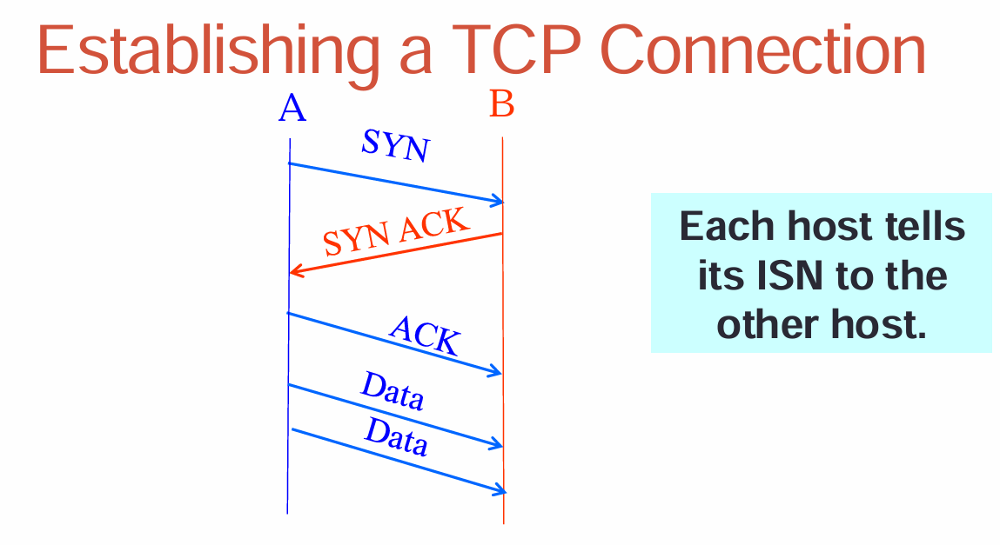
- 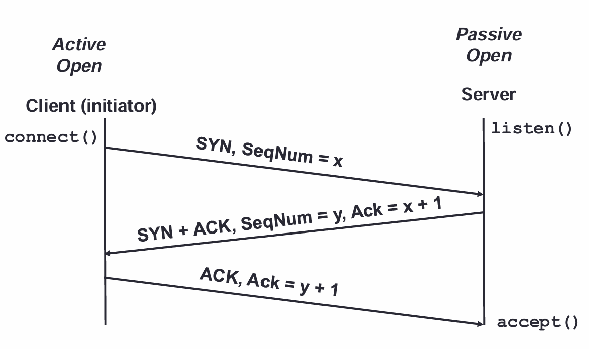

# SYN Packet을 잃어버렸을 경우
- Server discards the packet
- Sender set timer and waits SYN-ACK(and retransmit)
- 클라이언트나 서버 둘다 답장을 받지 못하면 retransmit을 하는데, 시퀀스넘버가 있어서 중복으로 보내도 꼬이지 않고 첫번째로 오는 걸로 연결을 만들고 이후 중복된 답장이 오면 무시함

# Connection Termination(4way hand-shake)
- X sends FIN to Y (active close)
- Y ACKs the FIN
- and Y sends a FIN to X (passive close)
- X Acks the FIN
- 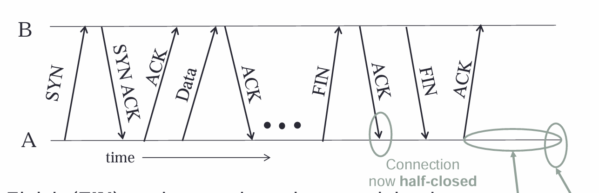
- 마지막까지 끝내면 완전히 closed
- 만약 마지막 ACK가 timeout이 되면, B는 FIN을 다시 보냄
- 모든 바이트가 ACK 응답을 받기 전에 FIN을 보낼 순 있지만, FIN이 ACK되기 전에는 연결 종료를 할 수 없음

# Abrupt Termination
- 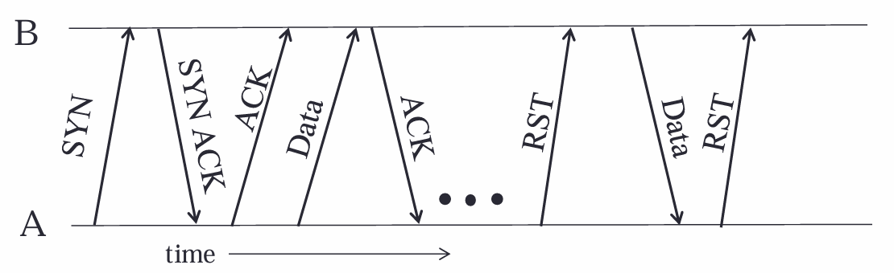
- A가 B에게 RST를 보냄으로써 비정상적인 연결을 종료하고 싶음
- RST는 ack를 기다리지 않음
- RST를 보낸 이후, 전송중인 데이터는 손실되고 추가 전송시 추가 RST 발생

# Situation
- 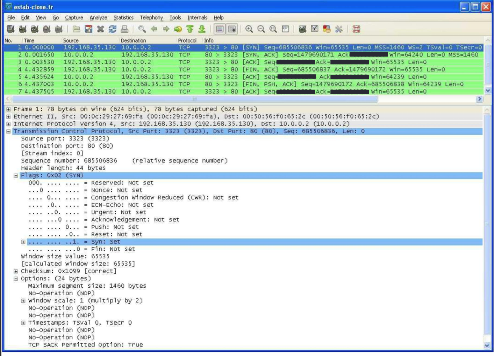

# SACK
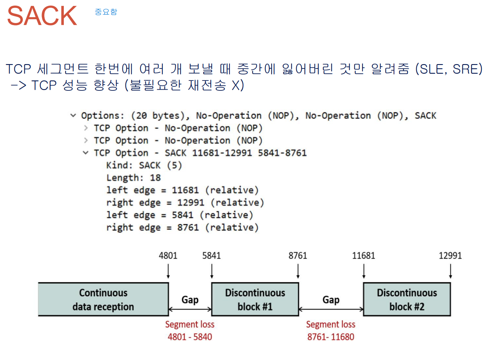
- TCP 세그먼트 한번에 여러 개 보낼 때 중간에 잃어버린 것만 알려줌(SLE,SRE)
- TCP 성능 향상
- 누적 ACK를 통해 빈 공간 이전에 완성된 구간을 얻고, SACK를 통해 빈 공간 이후에 받은 부분을 알 수 있음
=> 누적 ACK + 빈 공간 + SACK 구조로 빈 공간을 알 수 있음

# Flow Control
- 받는 사람의 버퍼의 크기를 말해줌으로써 window 크기 조절 

# Retransmission
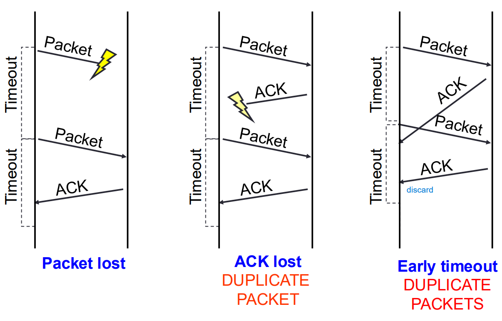
- RTT : 내가 세그먼트를 보내고, ACK를 받을 때 까지 걸리는 시간
- RTO : ACK가 오지 않을 때 재전송을 하기 까지 기다리는 시간

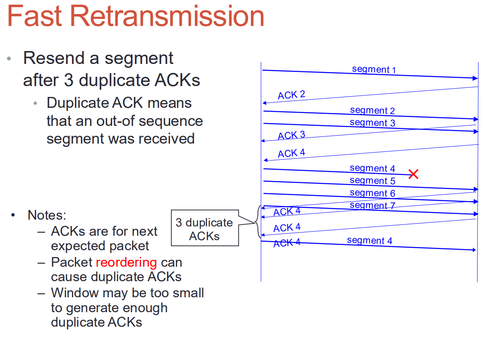
- Timeout의 대안 = Fast retransmission
- 3번의 중복된 ACK를 보내면 즉시 재전송

# Congestion Control
- 네트워크 혼잡 보호를 위해 보내는 사람이 속도 조절 
- Tahoe, Reno
- 처음엔 둘다 2배씩 증가하다가, ssthresh 도달 후 서형 증가
- Tahoe는 (Timeout, Fast retransmission)의 경우에 둘 다 임계값/2, 윈도우 사이즈 = 1
- Reno는 Fast retransmission의 경우에는 임계값/2, 윈도우 사이즈 = 임계값, Timeout의 경우엔 임계값/2, 윈도우 사이즈 = 1

흐름제어와 혼잡제어의 차이
-> 흐름제어는 수신자가 버퍼 여유를 알려줌으로써 윈도우 사이즈를 조절하는 것이고, 혼잡제어는 네트워크 신호를 보고 송신자가 스스로 윈도우 사이즈 조절하는 것