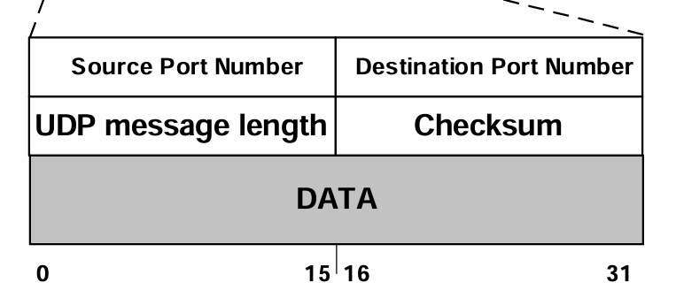
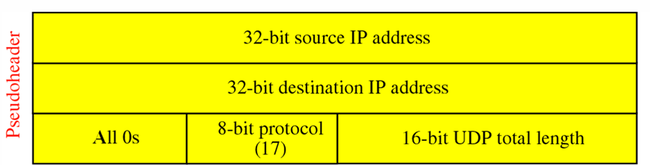
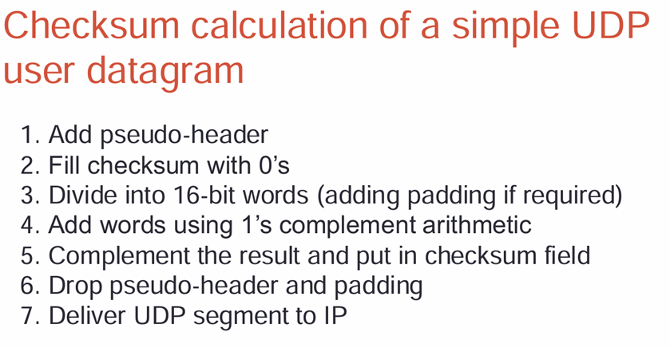
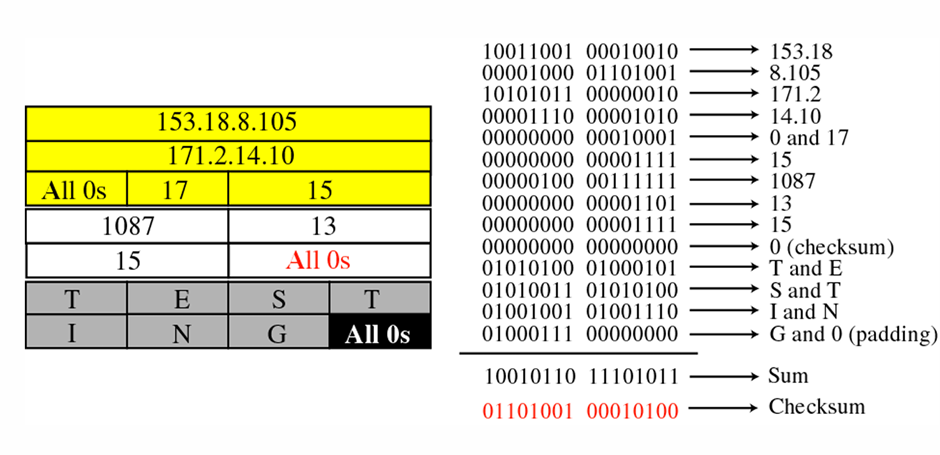
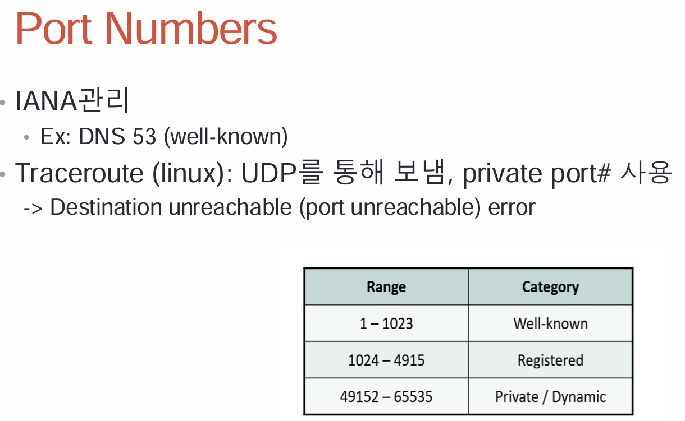

# UDP
- TCP는 reliable한 transmission을 위해 재전송을 하지만, UDP는 재 전송을 안 함
- Host에서만 지원을 해줌

# E2E Principle
- Functionality Guide로, 각각의 layer가 제공하는 기능
- Application은 end host에만 있어야 함
- **엄청나게 성능을 향상 시킬게 아니면 상위 layer에서 구현**
- router의 간섭없이 소통하는게 편하기 때문에 상위 layer에 function 구현
- **망 중립성** - 네트워크를 의도를 가지고 조작하면 안됨

## Transport Protocol
# UDP
- Datagram oriented
- Unreliable, **connectionless**
- Unicast, Multicast
- Non-unicast, realtime, short transactions 용도로 사용

## UDP Format
- IP header에 있는 message length를 통해서 UDP의 message length 유추 가능 (IP Total length - IP Header length)
- IPv4에서는 optional, IPv6에서는 mandatory(필수)
- checksum할 때 계산할 내용이 많이 없어서, 수도 헤더를 추가해서 계산
- 
- - 

- ICMP port unreachable이 발생하면, ICMP에서 UDP header을 가져감 
# checksum 계산하는 방법
- 
- 

왜 수도 헤더가 checksum에 필요할까?
- TCP와 UDP는 E2E protocol로, end user간 reliable하고 private한 문제기 때문에, router끼리 reliability를 챙겨주기 위함이 아님
- 밑에 애들이 access하지 못하는 정보로 checksum을 하기 위해서

## Port Numbers
- UDP는 port number을 사용자 구별을 위해 사용
- 전송 계층에서 IP 주소와 포트 번호(IP address, port number)의 조합은 전 세계적으로 고유한 주소로 사용
- 각 호스트는 최대 65,535개의 UDP 포트를 사용
- - 포트 번호는 0부터 65,535까지 할당되며, 일반적으로 0~1023번 포트는 잘 알려진(Well-known) 포트로 예약되어 있음
- 
- - UDP로 보내서, port unreachable을 통해 ICMP을 받아서 traceroute
- - well-known 은 하위 10비트

