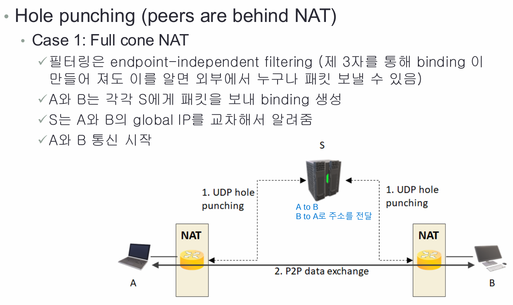
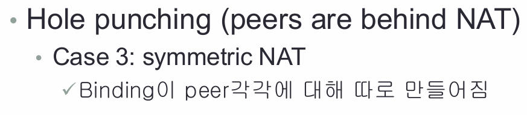

# SIP server
- Session을 만들어주는 protocol
- SDP를 통해 많은 정보를 전달

# Firewall with NAT
- 
- private -> public은 연락할 수 있지만, public -> private는 어려움
- application layer에서 RTP(Real-time Transport Protocol)를 위한 IP를 넣어두는데, NAT은 layer3까지만 건드려서 바뀌지 않음

# Enhanced firewall(ALG)
- 
- NAT/Firewall이 application layer까지 건드리게 함으로써, private-> public or public -> private를 자동으로 변환해줌

# STUN
-  NAT뒤에 있는 장치가 외부와 통신할 수 있도록 도와줌
- 외부 IP 및 port 확인 및 NAT 바인딩 유지가 목표
- 기본적으로 3478 port(TCP)와 UDP 사용 
- 
- STUN Server에서 public IP 및 port를 받고, SIP register에 저장 후 Client B와 통신
- XOR-MAPPED-ADDRESS : public IP를 magic cookie와 xor 하는데, ALG가 바꾸는 것을 확인하기 위함

# Example
- 
- - NAT 뒤에서 보냈으므로, Src에는 private IP가 들어감
- 
- - Response를 받을 때, 패킷 dest에는 private IP를 써놓고, Mapped- Address에는 public IP를 적어두고, Xor-Mapped-Address에는 IP와 port를 public xor magic cookie 한 값을 사용

# TURN(STUN Relay)
- STUN은 restricted cone NAT, symmetric NAT 뒤에 있는 peer 연결X
- behine NAT에 있는 client 사이에서 패킷을 relay
- 
- TURN에 데이터를 보내고, TURN이 다른 Client에게 보내줌
- 
- Turn Server에 보내고, Turn Server는 B에게 전달해줌

# Disadvantage of TURN
- Requires a lot of bandwidth
- ICMP not replayed
- TTL not properly decremented(possibility of loop)
- Symmetric NAT에서만 사용

# Situations
- 
- - A는 behind symmetric NAT, B는 public IP
- - A가 S:3478에 패킷 전송
- - NAT에 A:a - Y:y 바인딩 생성하고, 서버 S는 A의 public 주소를 앎
- - A는 symmetric이므로, <S:3478> 에서 <Y:y>로 온 패킷만 통과
- - 서버가 A와 통신하고 싶은 B의 IP를 알려줌
- - A는 B의 IP를 통해서 binding 생성하며, B는 public IP이므로 직접적으로 패킷을 받음
- - A는 B와 바인딩을 했기 때문에 B 또한 A에게 패킷 전송 가능

- 
- - A와 B는 각각 S로부터 서로의 주소를 얻음
- - 각각은 Full cone을 사용하기 때문에 binding을 생성한 상태
- - A와 B는 서로에게 IP를 통해 통신 가능

- 
- - A와 B는 각각 S로부터 서로의 주소를 얻음
- - A는 B에게 패킷을 보내면서 자신의 NAT filtering에 B를 추가
- - B에는 A에 대한 filtering이 없기 때문에 방금 보낸 패킷을 받을 수 없음
- - B가 A에게 패킷을 보내면서 자신의 Nat filtering에 A를 추가
- - A에는 이미 B에 대한 filtering이 적용되어 있기 때문에 B가 보낸 패킷을 받을 수 있음
- - 이후 연락 가능

- 
- - symmetric NAT을 둘다 사용하는 경우, A와 B는 각각 S와 바인딩을 통해 서로의 주소와 port 를 얻음
- - A가 B에게 패킷을 전송하려고 하면, A는 아까 받은 B의 port 번호로 바인딩을 시도하는데, 이는 B에서 이미 S와 연결되어있는 port기 때문에 연결할 수 없음

# ICE
- NAT 뒤에 있는 A와 B가 소통을 하려고 할 때, 적절한 IP 및 포트 후보자를 찾는 전체과정으로, 이 과정에서 STUN과 TURN을 사용하는 것

## 전체 흐름
- ICE는 후보자를 찾기위해 STUN과 TURN을 사용
# STUN
1. STUN의 경우, NAT 뒤에 있는 A가 먼저 STUN 서버에 트래픽을 보내고 STUN 서버는 A에게 A의 public IP를 전달해줌.
2. A는 해당 정보를 SDP를 통해 시그널링 서버에 HTTP 같은 프로토콜로 보내고, 시그널링 서버는 B에게 해당 SDP를 보냄. B도 똑같이 A에게 보냄으로써 서로의 public IP를 알 수 있게됨.
3. A는 B에게 트래픽을 보냄으로써 바인딩을 생성하고 처음엔 B가 바인딩이 생성되어있지 않아서 못 받지만, B가 A에게 트래픽을 보내면 연결이 성립됨.

# TURN
1. Symmetric Cone의 경우엔 A가 STUN을 통해 바인딩을 생성해서 B에게 해당 IP랑 포트를 전해줘도 의미가 없음. (그 바인딩을 STUN을 위한 바인딩이기 때문에.) 
2. 그래서 TURN 서버에 바인딩을 생성해서 relay를 통해 소통
