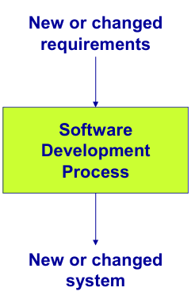
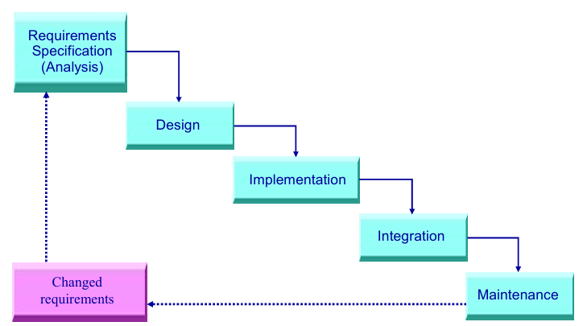
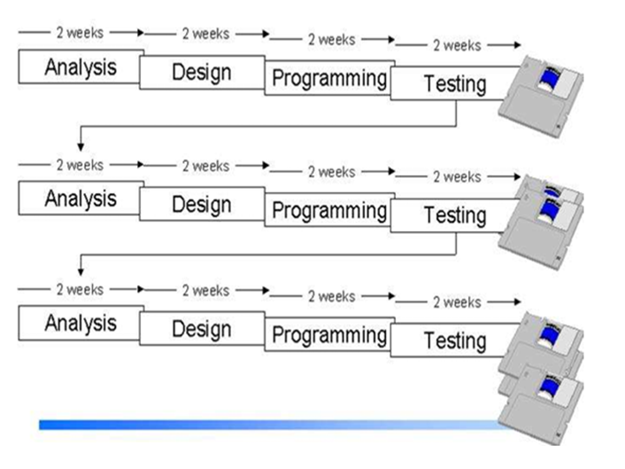
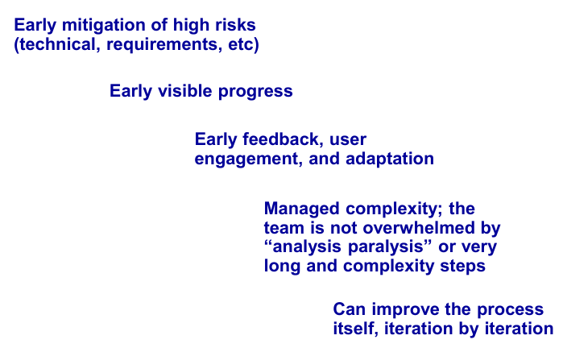
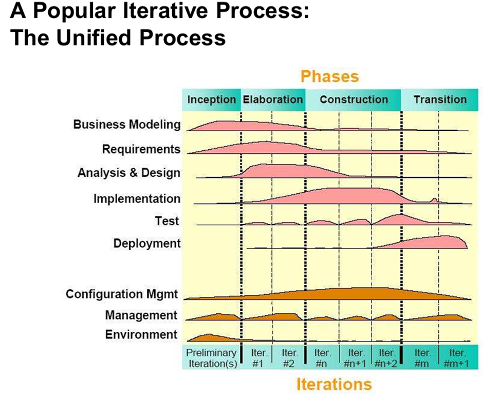
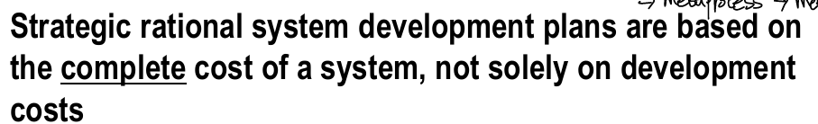
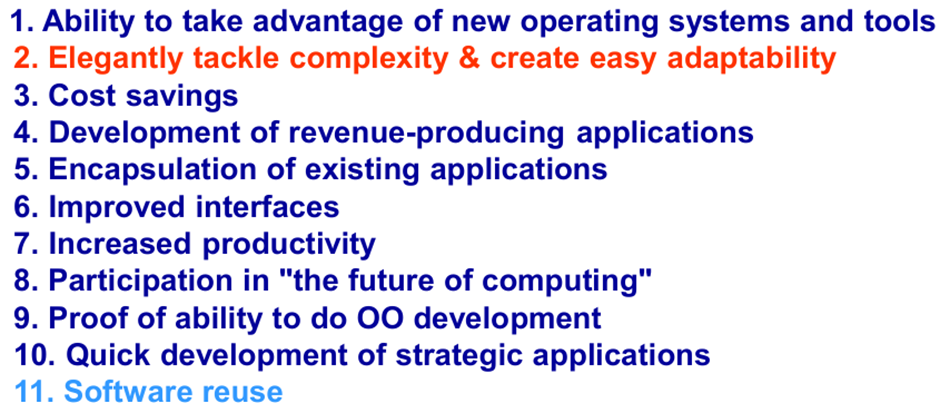
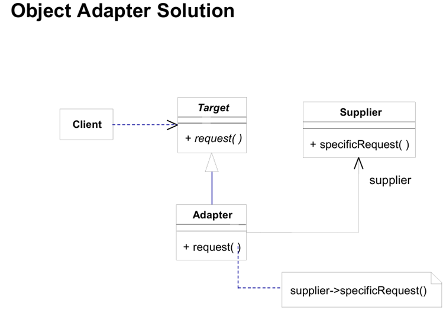
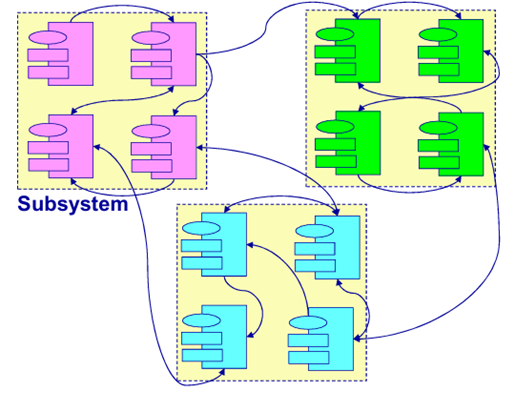

## Oriented-Object Programming
- 객체 지향 프로그래밍은 서로 다른 주특기를 가진 객체들이 상호협력하면서 문제를 해결해 나가는 형태의 프로그래밍

- 성공적인 소프트웨어는 stakeholder's requirements를 만족시켜야 함.
- **stakeholder** : 소프트웨어의 이해 관계자

- 성공적인 소프트웨어는 시간과 예산에 맞게 개발되어야 함.

- 성공적인 소프트웨어는 변화에 탄력적이여야 함.

성공적인 소프트웨어의 3요소
- 고객 만족
- 시간 및 예산 충족
- 탄력적인 변화

- software engineering이라는 단어는 복잡하고 커진 소프트웨어로 인해 탄생(추측)

- 개발 프로세스는 누가, 무엇을, 언제, 어떻게 특정 목표를 달성할지를 정의
- 소프트웨어 엔지니어링의 목표는 새로운 product를 만들거나, 이미 존재하는 product를 향상시키는 것

# 개발 흐름
- Analysis : requirements 검토
- Design : 어떻게 requirements를 실행할 것인가
- Implementation : Coding
- Testing : Test and go first
- Waterfall 방식

## Waterfall
# 단점
- Long delays
- High development cost
- High cancellation rate
- Low quality
- High maintenance cost
# 실패하는 상황
- 요구 사항이 정확하지 않고, 계속 변함
- 요구 사항이 정확하지 않고, 안정적이지 않음
-> moving target problem 발생

- 프로그래밍하기전에 디자인이 완벽하게 설계될 것이라고 생각함

# Conclusion
- **waterfall** 방식 더 이상 좋지 않음
- **iterative development**로 좋아지는 과정을 겪어야 함 - 여러번의 작은 watterfall을 겪음
- 다룰 수 있는 부분만 다뤄서 피드백도 여러 번 받는 이 방법을 여러 번 해서 완성시킴
- 한번의 waterfall 끝에는 바로 상용 가능할 정도의 완성도여야 함 
- 이전에 완성시켰던 것을 통해서 다음 기능에 변화를 줄 수 있음

# 알쓸 신잡
만약 기간내에 한번의 반복을 못 끝낸다면 어떻게 할까?
-> Testing 기간을 늘리지 않고, 다음 waterfall로 넘어감
Martin Fowler - iterative한 방식 매우 중요함
객체지향의 3대장 - 그레이디 부치, 제임스 럼보, 이반 야콥슨

# Benefits of Iterative Developement

- 개발을 진행할 때는 high risk인 부분을 먼저 시작
- visible progress
- early feedback
- 분석의 늪에 빠지는 analysis paralysis 현상 방지
- 매 반복마다 프로세스가 향상됨

# Unified Process

- 각 요소들을 어떤 phase에서 많이 하는 부분은 있지만, 비중이 다를 뿐 모든 활동을 함 -> **애자일 프로세스**

# Complete Cost

### 객체 지향을 사용하는 이유

- 소프트웨어 재사용(11위)이 큰 이유가 아님
- **복잡한 시스템을 다룰 수 있는 능력과 변화하는 환경에 대해 잘 적응할 수 있게 함**
- 저비용으로 변화에 대한 요구를 빠르게 따라갈 수 있게 함

# Design Pattern

- 디자인 패턴은 자주 발생하는 문제와 해결 방안에 대한 프레임 - Christopher Alexander

- Example) Adapter

- Supplier은 new를 통해 생성 가능
- Target은 Abstract class(이태리 글씨체)로 new를 통해 생성 불가
- Target과 Adapter 2개가 존재하는 이유는, Adapter가 바뀌더라도 Target은 바뀌지 않고, 컴파일 다시 안 해도 됨

# Framework
- frame은 특정 분야에 맞춰져 있음
- framework는 Design pattern 느낌으로, common한 structure
- framework is inversion of control
- reuse design and code
- 고정부와 변동부가 있으면, 고정부에서 변동 파트에 직접적으로 관여하면 안됌. 간접적인 함수를 통해서 접근해야 함
- 전역변수를 사용하면, 전역변수의 데이터를 변경할 시 모든 subprogram을 고쳐하니까, 지역변수를 사용하는게 Best

- 큰 Objects안에 작은 objects가 4개씩 존재.
- 객체지향은 마트료시카처럼 recursive한 구조

