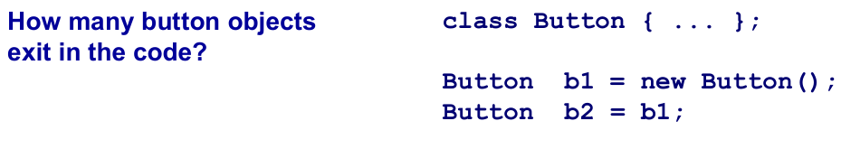
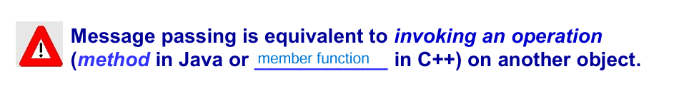

## Object
- Object는 비슷하지만, 서로 다른 개체
- Class는 비슷한 Objects의 그룹
- Inheritance는 상속으로, 관계를 정의할 수 있음
- 모든 객체는 의도가 있음 -> inheritance도 그에 맞는 의도로 사용해라

# Object란 무엇인가?
- 주변에 있는 것 중에서 사물이든 개념이 되었든, 확실한 경계가 있고, 고유한 의미가 있어야함(같은 펜 두개가 있어도 객체가 두개 있는 것)
- 경계가 애매한 것은 Identity가 있으면 object로 정의할 수 있음
- Identity를 정의할 때는 구분할 필요가 있는지 없는지에 대한 것이 중요
- 구분할 필요가 없는 것은 attribute (같은 5만원권이 있으면 상관없잖아)

- 추상적인 개념들 : attributes
- Object는 확실한 경계가 있어야 함

- Object는 고유한 주특기가 있어야 함
- 주특기는 다른 객체들과 상호작용 할 수 있는 수단
- 상호작용 하려면 interface or type 을 통해서 가능

# State
- Object는 **state**를 가질 수 있음.

- 언제, 어떻게 요청했느냐에 따라  state를 가질 수 있음.
- Object의 state는 현재 attributes의 value에 의해 결정(커피 머신에 코인을 넣엇을 때의 state, 커피가 없을 때의 state)

***State는 private하게 사용하는 것이 good enginnering practice***

# Identities
- Object는 unique한 identity를 가짐
- Objects = Behavior + state + identity

- button 1개(Java는 new를 해야 새로운 객체가 생김)
- 일란성 쌍둥이는 서로 다른 identity를 가짐

# Messages passing
- Objects는 request(message)를 주고 받음으로써 action을 수행함

- Message passing은 다른 Object를 호출하는 것과 같음. (Java: method, C++: member function)

- Receiver의 타입에 따라서 같은 message에 대해서 다른 action이 발생할 수 있음(Polymopolism).

- 사람이 객체를 위해 일하지말고, 객체가 사람 대신에 일해라(사람이 갑)

***implementation details를 encapsulate하는 것이 good enginnering practice***

# Encapsulation
- interface와 implementation을 구분
- code 재사용과 신뢰성 챙김
- public한 부분은 볼 수 있게 interface에, private한 부분은 implementation에 작성 

- Object가 어떻게 action 취하는지는 몰라도 되지만, 어떤 message를 보내야 