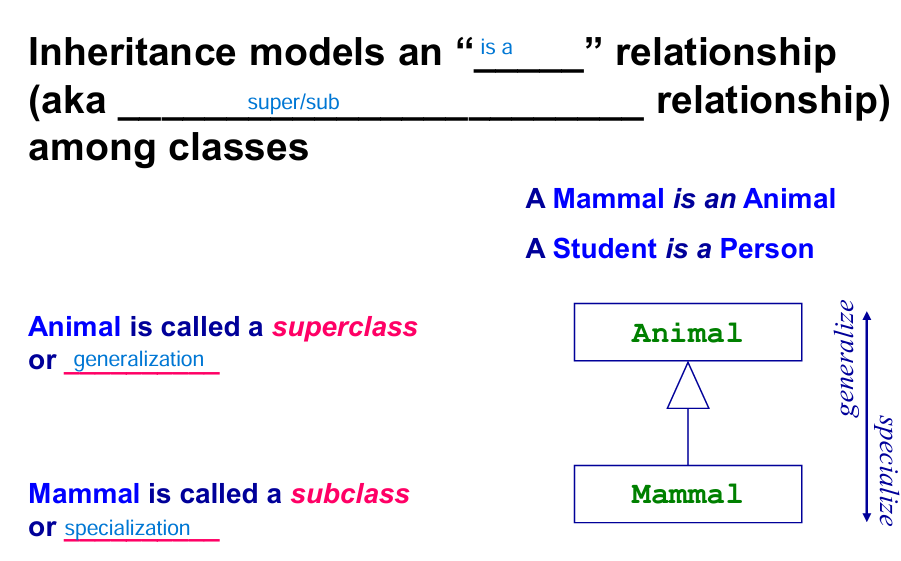

## Object
- Object는 비슷하지만, 서로 다른 개체
- Class는 비슷한 Objects의 그룹
- Inheritance는 상속으로, 관계를 정의할 수 있음
- 모든 객체는 의도가 있음 -> inheritance도 그에 맞는 의도로 사용해라
- 

# Object란 무엇인가?
- 주변에 있는 것 중에서 사물이든 개념이 되었든, 확실한 경계가 있고, 고유한 의미가 있어야함(같은 펜 두개가 있어도 객체가 두개 있는 것)
- 경계가 애매한 것은 Identity가 있으면 object로 정의할 수 있음
- Identity를 정의할 때는 구분할 필요가 있는지 없는지에 대한 것이 중요
- 구분할 필요가 없는 것은 attribute (같은 5만원권이 있으면 상관없잖아)

- 추상적인 개념들 : attributes
- Object는 확실한 경계가 있어야 함

- Object는 고유한 주특기가 있어야 함
- 주특기는 다른 객체들과 상호작용 할 수 있는 수단
- 상호작용 하려면 interface or type 을 통해서 가능

# State
- Object는 **state**를 가질 수 있음.

- 언제, 어떻게 요청했느냐에 따라  state를 가질 수 있음.
- Object의 state는 현재 attributes의 value에 의해 결정(커피 머신에 코인을 넣엇을 때의 state, 커피가 없을 때의 state)

***State는 private하게 사용하는 것이 good enginnering practice***

# Identities
- Object는 unique한 identity를 가짐
- Objects = Behavior + state + identity

- button 1개(Java는 new를 해야 새로운 객체가 생김)
- 일란성 쌍둥이는 서로 다른 identity를 가짐

# Messages passing
- Objects는 request(message)를 주고 받음으로써 action을 수행함
- 

- Message passing은 다른 Object를 호출하는 것과 같음. (Java: method, C++: member function)
- 

- Receiver의 타입에 따라서 같은 message에 대해서 다른 action이 발생할 수 있음(Polymopolism).

- 

- 사람이 객체를 위해 일하지말고, 객체가 사람 대신에 일해라(사람이 갑)
- 

- Object가 어떻게 action 취하는지는 몰라도 되지만, 어떤 message를 보내야 하는지 알아야 함

***implementation details를 encapsulate하는 것이 good enginnering practice***

# Encapsulation
- interface와 implementation을 구분
- code 재사용과 신뢰성 챙김
- public한 부분은 볼 수 있게 interface에, private한 부분은 implementation에 작성 
- 

# Class
- A Class is a group of objects with similar attributes
- Class는 객체의 속성이나 action의 저장소
- 

# Object
- Object는 class의 actual instance
- 
- Class는 factory, Object는 instance(product)
- **The terms instance and object are interchangeable.**

- Object는 여러 개의 type을 가질 수 있고, 다른 클래스의 object와 같은 type을 가질 수 있음
- 
- ClassD가 가질 수 있는 type
- - Class D, Class B, Storable, Runnable
- Class D와 X가 공유하는 type
- - Runnable
- - Class D는 부모의 타입을 다 가질 수 있음

- 
- 같은 Class로 만들어진 instance들은 identical attribute를 가지지 못할 수 있지만, 그들은 unique 함 
- Attributes들이 같아도, 다른 객체임

## (Public)Inheritance
- 부모 관계라는 단어로 나타내고 싶은 진짜 의미가 뭘까?
- 
- 부모는 general 한 개념을 포함하고, 자식은 부모의 개념 + specialize한 개념
- Mammal은 subclass, Animal은 superclass

- 
- 하나의 class는 superclass 이면서, subclass가 될 수 있음
- Cat은 specialize한 Animal (Animal <- Cat)

- 
- 하나의 class는 여러 개의 class 상속 가능

C++에서는 private 자식 Object를 생성하면, 메모리는 부모와 함께 할당되지만, access는 불가능
Inheritance hierarchy를 만들 때, 어떤 방식으로 만들까?
- Top Down && Bottom Up 둘다 사용

- 
- Subclass 들은 부모 및 조상의 operation을 전부 물려받음
- Dog & Cat은 nurse(),sleep(),eat(),play()를 가짐
- Superclass의 특징은 SubClass의 공통된 특징

- 
- Subclass는 상속된 operation을 재정의 할 수 있음 (Overriding)
- rating 이라는 operation을 상속받아서 쓰고 싶은데, 기능을 바꾸고 싶음
# **Overriding**
- - Overriding 할때는 signatures(header)을 바꾸면 안됨
- - 부모의 함수를 사용하고 싶으면 super.rating()
# **Overloading**
- - 하나의 class안에 이름이 같은 메소드를 여러 개 define
- - int add(a,b) , int add(a,b,c) 처럼 이름은 같아도 구분은 할 수 있어야 하니까 signature중 무언가를 바꿈(Type or parameter)

# is a relation
- Student is a Person, 역은 성립하면 안됨
- 부모는 포괄적인 개념, 자식은 전문화된 개념
- - ***부모가 할 수 있는 일은 자식도 다 할 줄 알아야 함***
- - ***부모를 사용할 수 있는 곳이면, 자식이 대신 할 수 있어야 함 (LSP-Liskov Substitution Principle)***

# interface inheritance
- 
- ineritance의 목적은 interface의 공유
- interface의 공유 목적으로 사용할 때는 supertype, subtype로 분류 가능

# implementation inheritance
- 코드 재사용의 목적으로 상송
