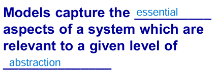
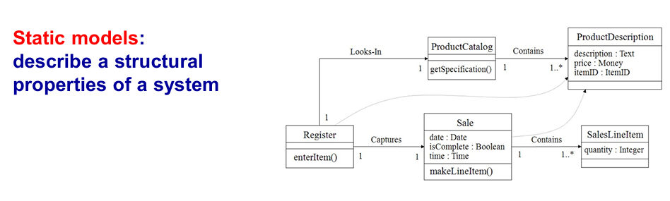
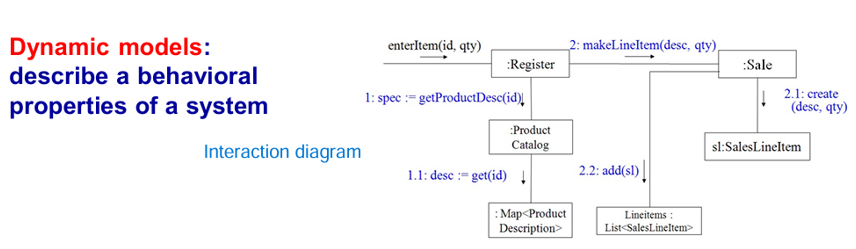
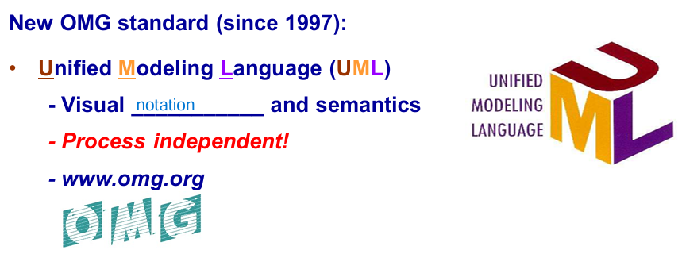
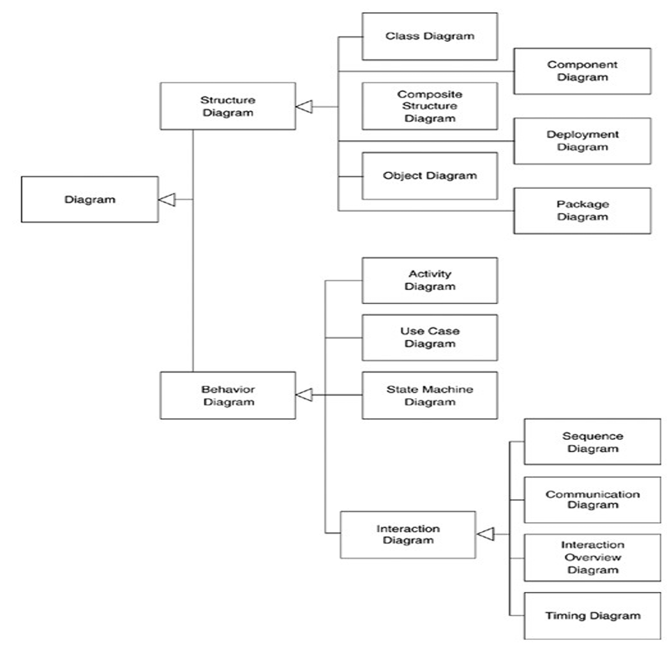

# Review
- Assignment가 일어나려면 sub를 super에 assign해야 함
- Super <- Sub(Super)
- Java는 deafult로 virtual type을 사용
- C++에선 기본적으로 static type이므로, 정적 바인딩을 하기 때문에 compile time에 메소드 호출이 결정된다. runtime에 메소드를 호출하고 싶으면 virtual type으로 선언한다.
- Java에서는 기본적으로 virtual type이므로, runtime에 메소드 호출이 결정된다.

## Model
- 
- 
- Model은 단순화를 시켰을 때, essential aspects가 있어야 하고, 특정 abstract 수준에 맞게 필요한 부분만 다룸
- Model은 그 Model에서만 보여주는 특징만 볼 수 있기 때문에, 전체를 보려면 여러 Models을 봐야 함

# Static Models
- 
- 구조적인 특징을 나타냄
- Static Models만 보고는 Model이 어떻게 운영되는지 알기 어려움

# Dynamic Models (Interatction Diagram)
- 
- 행동적 특징을 나타냄
- Dynamic을 통해 어떻게 동작하는 지 알아야 함

# Modeling
- 복잡한 시스템을 전체적으로 이해하기 위해 사용
- 시스템의 중요한 부분을 단순화하고, 구조와 동작을 표현함으로써 개발 당시에 어떤 의사결정 과정을 거쳤는지 이해를 도움
- 
- 모델은 다양한 레벨이 존재

# Visual Modeling
- **UML**
- 많은 양의 데이터를 그림으로 communication 하는 것이 효과적

## UML
- 가장 일반적인 visual modeling language로, 개발 notation 통일
- UML은 개발 Process가 아니라 visual notation일 뿐(independent)
- 
- UML 2.0
- 