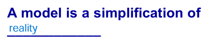

# Review
- Assignment가 일어나려면 sub를 super에 assign해야 함
- Super <- Sub(Super)
- Java는 deafult로 virtual type을 사용
- C++에선 기본적으로 static type이므로, 정적 바인딩을 하기 때문에 compile time에 메소드 호출이 결정된다. runtime에 메소드를 호출하고 싶으면 virtual type으로 선언한다.
- Java에서는 기본적으로 virtual type이므로, runtime에 메소드 호출이 결정된다.

## Model
- 
- 
- Model은 단순화를 시켰을 때, essential aspects가 있어야 하고, 특정 abstract 수준에 맞게 필요한 부분만 다룸
- Model은 그 Model에서만 보여주는 특징만 볼 수 있기 때문에, 전체를 보려면 여러 Models을 봐야 함

# Static Models
- 
- 구조적인 특징을 나타냄
- Static Models만 보고는 Model이 어떻게 운영되는지 알기 어려움

# Dynamic Models (Interatction Diagram)
- 
- 행동적 특징을 나타냄
- Dynamic을 통해 어떻게 동작하는 지 알아야 함

# For better Understanding system
- system을 시각화하기
- 구조 및 작동을 구체화하기
- 설계도 작성하기
- 결정 사항들을 문서화하기

# Modeling
- 복잡한 시스템을 전체적으로 이해하기 위해 사용
- 시스템의 중요한 부분을 단순화하고, 구조와 동작을 표현함으로써 개발 당시에 어떤 의사결정 과정을 거쳤는지 이해를 도움
- 
- 모델은 다양한 레벨이 존재

# Visual Modeling
- **UML**
- 많은 양의 데이터를 그림으로 communication 하는 것이 효과적

## UML
- 가장 일반적인 visual modeling language로, 개발 notation 통일
- UML은 개발 Process가 아니라 visual notation일 뿐(independent)
- 

# UML 2.0
- 
- - UML1 -> UML2로 넘어가면서, Use Case가 동적으로 바뀜
- - Collaboration -> Communication으로 바뀜

# UML이 나온 이유
- UML as sketch - 아이디어를 빠르게 시각화
- UML as blueprint - 구조와 설계를 명확하게 정의
- UML as programming language - UML을 직접 사용하여 코드를 생성하거나 모델에서 코드를 추출하는데 사용

- Forward Engineering
- - 코드를 작성하기 전에 UML을 작성하는 방식으로, 전체 구조 계획에 도움

- Reverse Engineering 
- - 이미 존재하는 코드에 UML을 작성하는 방식으로, 복잡한 코드 구조를 이해하거나 문서화하기 위해 사용

# Object-Oriented Design
- 
- 자체적인 디자인으로, 개념적인 solution
- 디자인할 때, 언어는 어떤 것을 사용할지 정하진 않음

# Object-Oriented Programming
- 분석, 디자인, 프로그래밍의 cycle

# How to use Object
- 분석과 설계, 구현이 하나의 흐름으로 쭉 이어짐
- Real world 객체라고 하잖아. 처음에 만들었던 객체를 쭉 사용함
- 여러가지 방법이 존재, 정답은 없음

## Example
- 
- Requirement & Object-oriented 는 같이 분석되어야 함 
- Design도 동시에 되는 게 이상적이지만, Interaction diagram이 선행되고, design class diagram이 따라오는 느낌

# Define use case
- 
- Domain process 설명

# Define domain model(OOA)
- 
- object 관점에서의 domain에 대한 설명
- software object에 대한 설명은 없음
# Define Interaction Diagrams(OOD)
- 
- 동적인 model을 먼저 설계
- Interaction diagram (Sequence)
- 화살표의 흐름이 어떻게 흘러가는가 “가 매우 중요함
- 반드시 해야 될 action으로 responsibilities 라고 함
- 객체지향에선 주특기를 잘 할 것 같은 class한테 시킴

# Define Design Class Diagrams(OOD)
- 
- Class의 attributes와 method를 작성
- 상대방에게 함수를 시키려면 서로 관계가 있어야 함
- Interaction diagram에 있는 object들은 있어야 함

**동적인 diagram이 정적인 diagram을 끌고 가야 함**

### Review
- 
- development process 는 어떻게 goal에 도달할 것인지 정의

## UP
- 
- Architecture을 iterative & Incremental 방식으로 빠르게 만들어서 안정화가 중요(뼈대 만들기)
- Iterative and incremental development – problem domain에서의 object들이 중요 함
- Use-Case 중심으로 프로젝트를 진행해야 함
- UP는 프로젝트 성격에 맞춰서 사용

# Development Cycle
- 
- 사전에 설계 및 조사

# UP Phase : Inception
- 
- 이를 토대로 **go or no go** 를 결정(Inception)

# UP Phases : Elaboration
- 
- 초기 단계 반복으로, 결국 아키텍처 개발해서 검증
- 리스크 factor가 큰 애들 빨리 해소
- 분석 활동에 상대적으로 많은 시간이 들어감
- 프로젝트의 성공 or 실패 여부를 결정하는 것은 Elaboration phase

# UP Phases : Construction
- 
- 중요한 것은 Elaboration에서 했으니, risk factor가 작은 작업 진행

# UP Phases : Transition
- 

# 추가적인 UP Best Practices
- risk가 큰 것부터 빠르게 개발 및 evaluation,feeback,requirements를 통한 진전 
- 메인 architecture을 빠르게 생성 및 연속적인 테스트
- Use-case 적용
- Model software 을 시각적으로 보여주기(UML로)
- 요구사항 분석

# UP Disciplines and Artifacts
- 
- Discipline - 특정 분야에서의 활동으로, 각 phase마다의 활동의 집합
- Artifact - discipline을 통해 만들어 낸 product

# Development Case
- UP는 프로세스를 위한 프로세스로, 메타 프로세스
- UP를 프로젝트에 맞게 재구성함
- 결국 남는 건 UP에서 필요한 것만 가져온 customized process

## Two Desert Island Skills in OOA & OOD
# Assigning responsibilities to software components
- sw 설계 잘해서 누구에게 responsibility를 맡길지 잘 설정
# Finding suitable objects or abstractions
- 현실을 sw로 옮기기
# OOD is all about responsibility game 
- 기능을 누구에게 맡길지가 중요

# RDD
- 