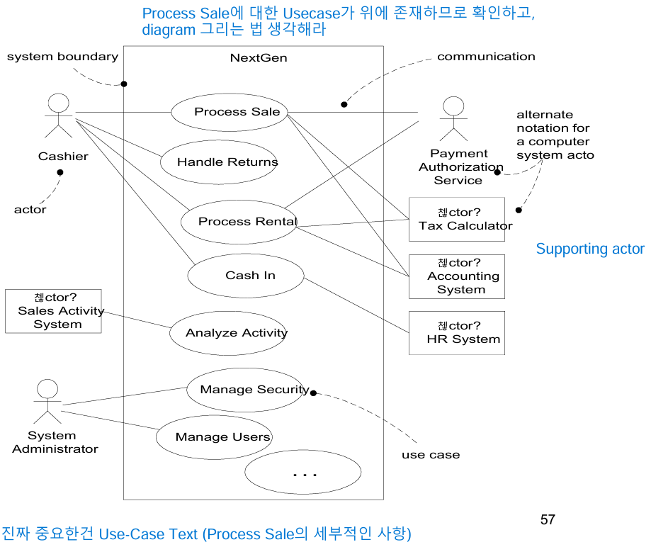

## Inception Phase
# Inception
- Envision the product scope, vision and business case
- 제품 범위, 비전, 비즈니스 사례 구상
# 주요 문제
- 이해 관계자들이 프로젝트 비전에 대해 기본적인 합의를 이루었는가?
- 이 프로젝트를 진행할 가치가 있는가?
# Artifacts in Inception Phase
- Use-case Model : 기능적인 요구사항과, 이에 연관된 비기능적인 요구사항 정리
- 

## Useful Classification
# functional requirements
- 시스템의 behavior 설명
# non-functional requirements 
- quality attributes or quality requirements 라고 부름
- 기술적 제약
- 비즈니스 제약
# functional requirements record
- Use-Case model에 기록됨
# non-functional requirements record
- vision artifact - high-level requirements의 요약
- Glossary - 용어 사전 

# Motivation for Use Case
- 분석, 기록, 기능적 요구사항 발전을 위해 Use-Case
- 구현해야 할 것을 알기 위해 Use-Case
- client는 뭐가 구현될 지 알아야 하므로 Use-Case
- **Stories of using a system to meet goals**

## Actor
- actor은 System 외부에 존재하며, 상호작용 하는 모든 것
- actor은 행동을 가진 모든 것(System까지)을 포함(actors and goals model 관점) 

# Types of Actor
- Primary Actor
- - system을 사용하여 사용자 목표를 달성하는 actor (Caller)
- - 사용자 목표를 찾아내기 위해 사용
- Supporting Actor 
- - System에 서비스를 제공하는 actor (기지국)
- Offstage Actor
- - use-case의 행동에 관심이 있지만 primary or supporting이 아닌 actor

# Scenarios
- 특정한 행동의 순서로, actors 와 system 사이의 interaction : Use-case instance

## Use-case
# Use-case
- 성공 및 실패 시나리오의 collection
- 사용자의 관점에서의 행동을 문서화
- 주로 기능적 요구사항 설명
- goal statement + scenarios = Use-case 
- 이름은 동사를 먼저 사용
# Unified Process Definition
- Use-case는 여러 instance의 집합이며, instance는 눈에 보이는 결과가 있어야 함

## Black-Box vs White-Box 
# Black-Box Use Case
- System Usecase
- describes functional requirements
# While-Box Use Case
- Business Usecase
- describes operations of the business

## Use Case Format
# Brief format
- Main success scenario만 제시
# Casual format
- Main success + important scenarios 제시 
# Fully dressed format (One or Two columns)
- 모든 scenarios
**brief to Fully 방식으로 흘러가는게 좋음**

## Usecase is behavioral part of contract between various stakeholders
- action or interaction between to actors with goals
- 시스템이 내부적으로 수행해야하는 작업으로, to protect stakeholders with interests
- actor와 actor 사이의 interaction
- actor는 목표 달성을 위해 행동하거나 다른 actor를 지원.
# Actors and Goals model
- Actor와 그들의 목표에 중점을 둔 모델로, 시스템의 internal behavior은 설명X
# Stakeholders and interests model
- Actors and Goals model + 시스템의 internal behavior 설명

# 이해관계자들의 목표를 만족하기위한 actions
- An interaction between two actors (to further a goal)
- A validation (to protect the interests of stakeholders)
- An internal stage change 
**Usecase의 시나리오는 모든 stakeholders의 이익이 충족되거나 보호될 때 종료**

### Fully dressed format
# Primary Actor
- Primary Actor는 시스템과 상호작용의 시작점이며, 시스템의 기능을 활용해 자신의 목표를 달성하려는 stakeholder
# Stakeholders and interests
- 이해관계자의 모든 이익을 충족
- 시스템의 모든 필수 동작이 포함
## Preconditions and Postconditions
# Preconditions
- 유스케이스 실행 전 필요한 조건
- 시스템이 유스케이스를 시작하기 위한 전제
# Postconditions
- 유스케이스 실행 후 보장되어야 하는 상태
- 시스템이 유스케이스 완료 후 이해관계자의 요구를 충족하는지를 확인
# Main Success Senario
- Usecase의 첫 단계는 이벤트 트리거
- 조건부 논리 및 분기는 Extension
- actor 들과의 상호작용, validation, stage change by system
## Extension
- success 시나리오 외 고려해야할 상황
- extension has two parts
- - condtion : Actor or system이 감지할 수 있는 상황 (시스템이나 actor가 감지할 수 있도록 조건 작성)
- - handling : 해당 조건이 발생했을 때 처리 할 방법
# Extensions의 종료 처리
- 확장 흐름이 완료되면, 기본 성공 시나리오(Main Success Scenario)로 병합. 확장 흐름이 시스템을 중단하거나 다른 시나리오로 전환을 명시하지 않는 한 기본 시나리오로 return
- 예외적인 경우, 시스템의 작동이 중단되거나 확장 시나리오가 독립적인 흐름을 구성하는 경우 다른 방향으로 진행될 수 있음
- - 복잡한 흐름의 경우 별도의 usecase 구성하는 것이 좋음
# Subordinate use cases
- 유스케이스 설계에서 상위-하위 관계를 사용하는 방법
- 
- 능동형 동사를 사용해서 명확히 동작을 언급
# Special Requirements
- Special Requirements는 특정 유스케이스와 관련된 비기능적 요구사항 및 제약 조건을 정의
- 시스템의 사용성, 성능, 확장성, 및 유연성과 같은 품질 속성을 보장할 수 있음
- 
# Technology and Data variations List
- 기술과 데이터 처리에서 구현 방법을 명확히 기록
- 조건별 행동은 Extensions 섹션에 포함되어야 하며, 이 섹션은 기술적 세부사항에만 집중

## UC 에서 중요한 4가지 concept
# level : Why do we want this goal?
- 금액 입력 → 현금을 인출 → 점심을 사기 위해
# Scope : Which system boundary do we mean?
- 시스템 또는 프로세스의 경계를 명확히 정의
# Detail : Do we describe intent, or action detail?
# Primary Actor : Who has this goal?

# Level of UC
- 
- 모두 다른 UC에서는 유효할 수 있지만, UC에서는  Handle returns 정도가 적절한 목표
- **EBP or User Goals UC** 정도가 Requirement Analysis 에서는 유용함
- EBP : Single sitting task 정도의 업무
- 모든 문장은 goal
- - 
# Summary, User, Subfunction Goals의 계층적 관계
- 
- Summary Goals: 고 수준의 목표
- User Goals : 사용자가 달성하고자 하는 목표
- Subfunction Goals : 사용자의 목표를 지원하기위해 사용되는 구체적인 기능
- 사용자 관점에서 목표를 정의하고, 이를 구현 가능한 세부 기능으로 분해 

# Primary Actors and goals at different boundaries
- Boundary가 명확해야 actor를 제대로 설정할 수 있음
# Basic procedure
- 시스템 경계 설정 → Primary Actor 식별 → 사용자 목표 정의 → 목표를 만족시키는 유스케이스 정의의 순서로 진행(actor-goal list 생성)

## Process
# 1. Choosing the System Boundary
# 2. Finding Primary Actor
- Reminder Questions to find Actors
- - primary actor 찾는 방법
- - 
# 3. Finding goals
- Reminder Questions to find Goals
- - 각각 actor가 가지고 있는 goal 찾는 방법
- Actor-based Approach
- - Actor 가 참여하는 프로세스 식별
- Event-based Approach
- - 시스템이 반응해야 할 외부 이벤트 식별
- Actor-Goal List
- - 
# 4. Define UseCase
- define one EBP-level

# Essential vs Concrete UC
- Essential은 Analysis 단계로, 기술적으로는 구체적으로 작성하지 않음
- Concrete는 Design 단계로, 기술적으로 구체적으로 작성

# Use Case Diagram
- UC와 actors의 relationship
- 

# Why Use Case?
- 