# Elaboration 
- high risks factor이 처리되어야 하는 phase
- core arhcitectural elements 가 구현되어야 하는 phase
- iterative phase
- iteration 이후에는 final system이 나와야 함.
- 

# Planning the Next Iteration
- Risk
- Coverage - 이 부분을 건드리기 위해 얼마나 많은 부분을 건드리는게 좋을까?
- - 얇고 넓게 건드려 봄
- Criticality - 중요성

# Artifacts Start in Elaboration
- Domain Model - domain 개체들의 정적인 정보랑 유사하며, domain 개념의 시각화
- Design Model - logical design으로, class diagram, Interaction diagram 의 집합

## UC model

# Drawing System Sequence Diagrams
- events와 operation 식별
- primary actor가 뭘 하는지가 중요
- 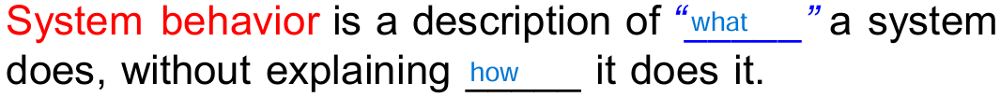
- - System behavior은 시스템이 뭘 하는지에 대한 설명
- system sequence diagram은 system을 black box처럼 대함
- SSD는 actor와 system 사이의 경계를 강조

# System Events & System operations
- 외부의 Actor 로 부터의  stimuls 에 대한 응답이 system operation
- system operation - system event 가 발생했을 때의 operation 

# SSD
- 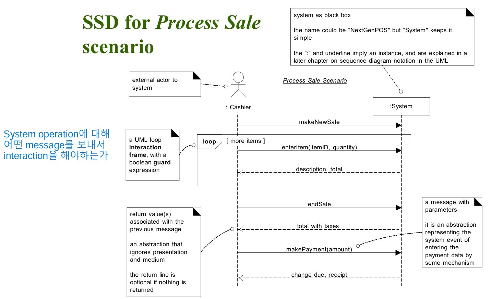
- System operation에 대해 어떤 message를 보냄으로써 interaction 하는가 포인트
- UC중 하나의 scenario에 대한 system events를 보여줌
- 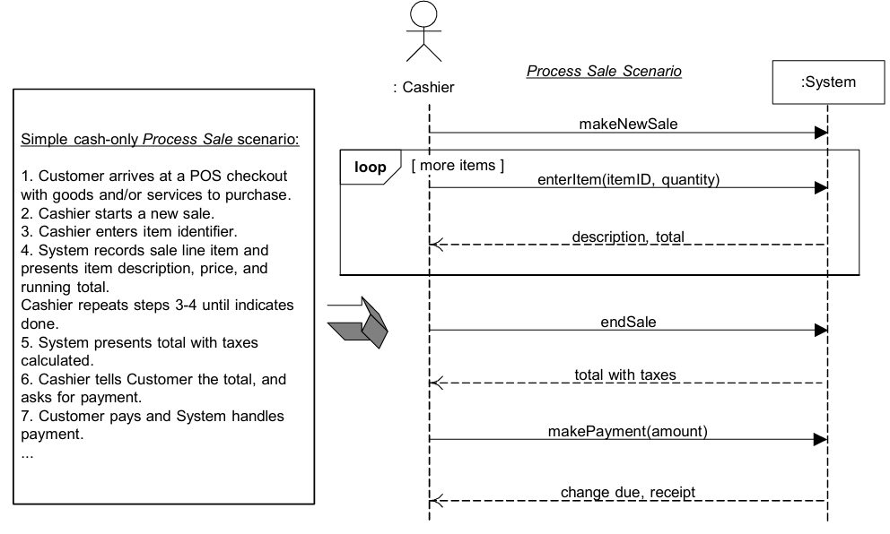
- - 왼쪽은 UC Text, 오른쪽은 SSD
- - text는 detail을 제공하고, SSD는 시각적인 상호작용의 summarize

# Naming System events / operations
- shoud be expressed at highest level of intent
- start with verb

# Recording System operations
- UML class diagram icon 은 operation을 기록함 
- 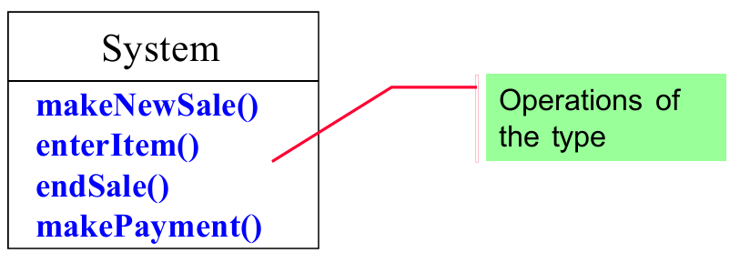

## Class Icon
- 클래스 이름
- 속성 +: Public, #: Protected, -: Private
- operations 
- 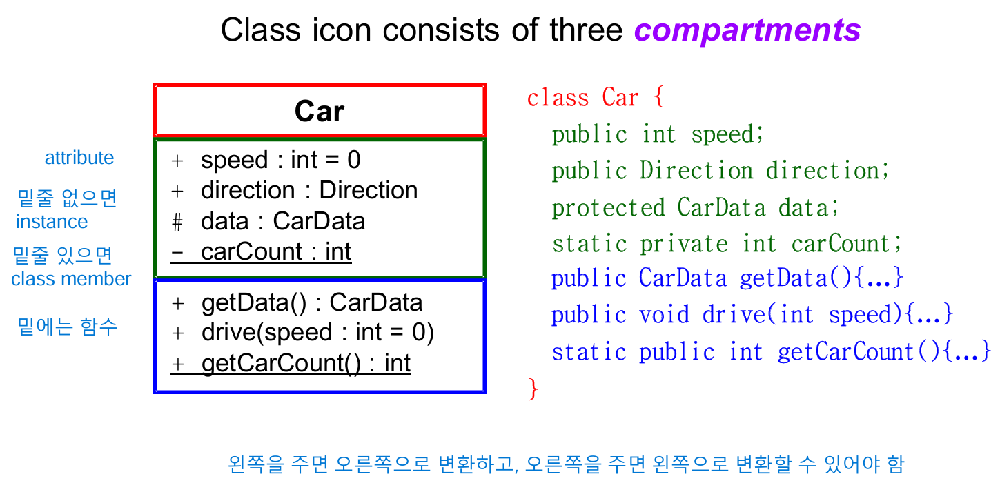
- - getData() : CarData 는 CarData형 반환
- - drive(speed : int = 0) : speed 값을 parameter로 받음
- - getCarCount() : int 는 int 형 반환 
- 밑줄이 있는 경우 instance, 없으면 class member(static)

# How to make System Sequence Diagram
- 외부 actor와의 상호작용을 선으로 그림
- system에서 작동하는 actor마다 선으로 연결
- Actor가 system에 보낸 request와 시스템의 response를 순차적으로 그림
- UC Text도 다이어그램 왼쪽에 추가

# Requirements 분석
- UC Diagram
- UC Text
- System Sequence Diagram
- Operation Contracts
- - Operation Contracts의 post condition을 정의해야 하는데, 이를 위해 Domain model 설정

# Domain Model: Visualizing Concepts
- 현재 요구사항과 관련있는 conceptual class 식별
- 초기 domain model 생성
- 올바른 attributes 선택
- 필요에 따라 specification conceptual class 추가
- 개념적 설계가 구현 과정에서 잘 반영되었는지 비교 및 대조 

# Analysis vs Design
- 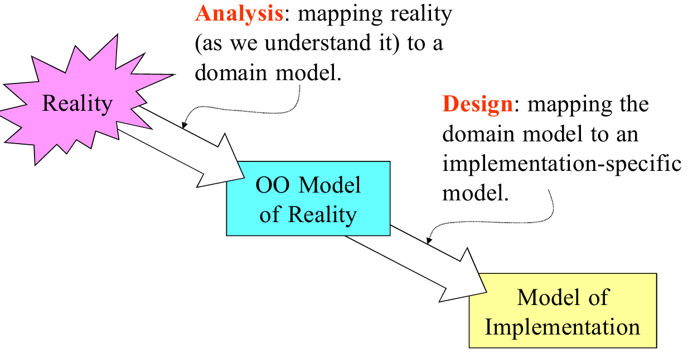
- Analysis - 현실에 있는 걸 domain model에 mapping 
- Design - domain model에 있는 걸 implementation-specification model에 mapping 
- 현실 problem -> Class Diagram으로 표현 -> Domain model

# Domain Models
- Class Diagram으로 표현한 현실 세계의 objects
- 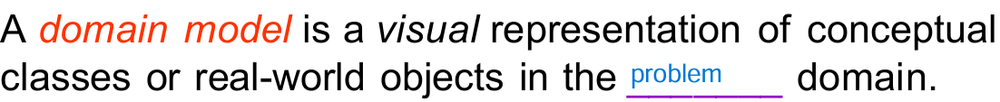
- 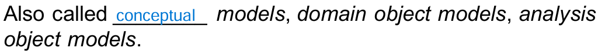
- design이 아니라, 우리가 이해하고 있는 현실에 대한 설명
- Object Oriented analysis 에서 만들 가장 중요한 artifact
- UP에서 domain model은 operation이 정의되지 않은 class diagram 으로 표시
- - domain objects or conceptual classes
- - associations between conceptual classes
- - attributes of conceptual classes 
- - 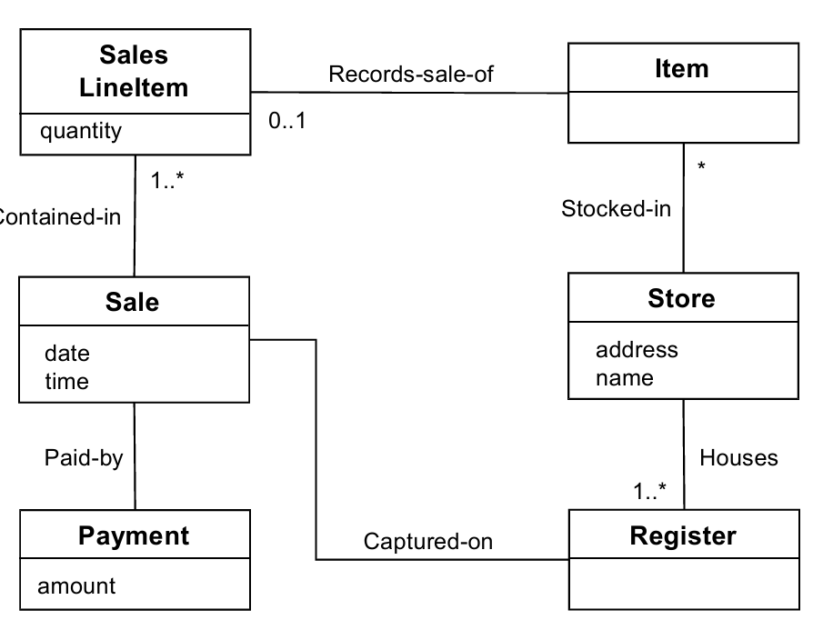

# Conceptual Class
- Symbol - 개념적인 class를 representing 
- Intention - definition of conceptual class 
- Extension - 개념적 class가 적용되는 모든 구체적인 예제의 집합 
- 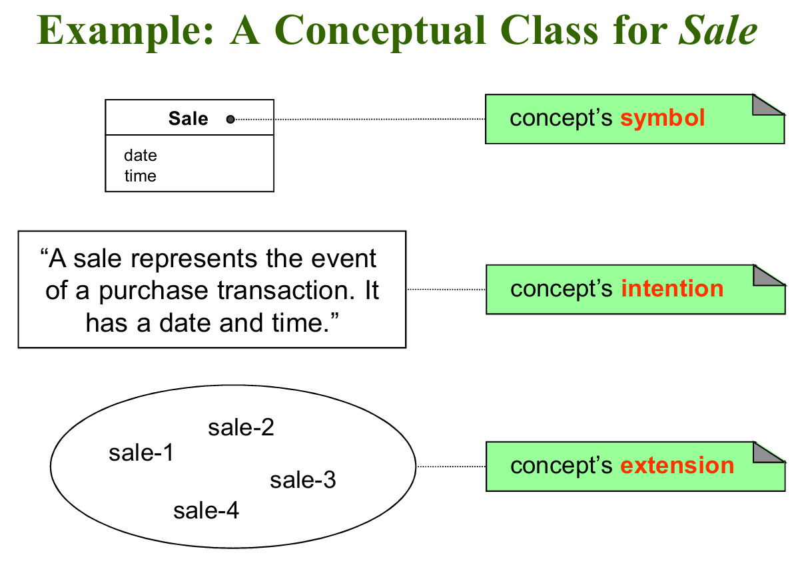

# How to identify Conceptual Class
- conceptual class 카테고리 리스트를 사용하여 식별
- 명사 식별
- domain model을 작성할 때, 더 많은 세부 class를 식별하는 것이 적은 class를 식별하는 것 보다 나음
- 속성이 없는 conceptual class 라도, modeling 할때  중요한 역할을 함
- Conceptual class에는 속성 없이 behavior만 포함할 수 있음

# Include receipt in the model?
- 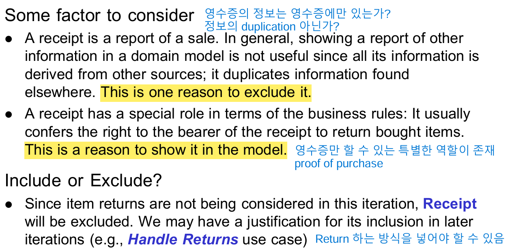
- 영수증은 영수증 만이 할 수 있는 특별한 역할이 존재
- iteration에서 return은 생각하지 않음. 다른 iteration에서 return하는 방식 고려

**KISS** - Keep it simple and stupid
**DRY** - Don't repeat yourself

# How to make Domain Model?
- Conceptual Classes 후보 나열
- Domain model에 class 그리기
- Associations 추가
- Attributes 추가

# Things to remember
- object = state + behavior + identity
- conceptual classes 와 attributes 의 이름을 지을 때는 현실 세계의 용어를 사용
- 관련없는 특징 제거 
- conceptual classes와 attributes를 헷갈리지 말 것 
- Conceptual class는 객체의 본질을 나타내고, attributes는 객체의 구체적인 특성
