# Software Development Process
- 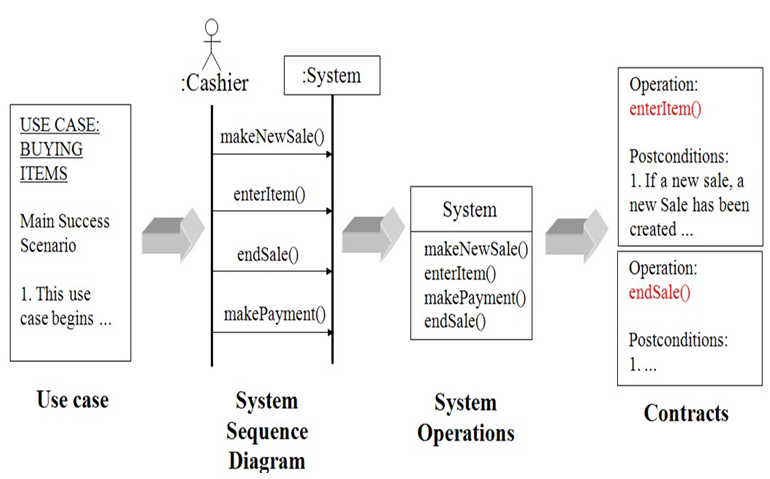
- Use case -> System Sequence Diagram -> System Operation -> Contracts

# (Domain Model) Adding Association & Attributes
- Association identify
- 필수적인 association과 이해를 돕기위한 association identify
- attributes 식별
- correct or incorrect attributes 식별

# Association
- conceptual classes 간의 관계로, 의미가 있는 연결
- UML에서는 structual relationship 로서 defined
- 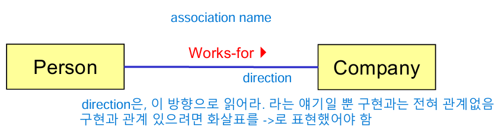
- self Association
- 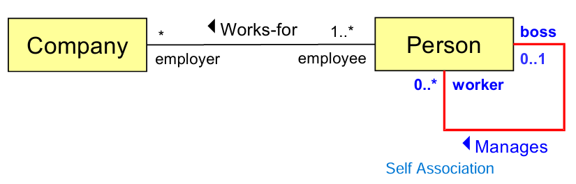
- 단방향 Association
- 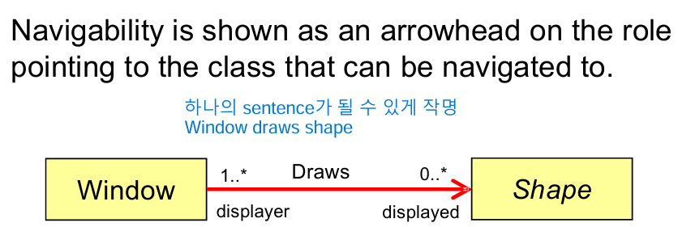

# Useful Association
- 설계와 구현은 같이 가야함. 구현에서 수정되면 설계도 고쳐야 함
- Need-to-know association는 시스템 관계 데이터를 추적하고 유지할 필요가 있으면 반드시 포함해야 함
- Association 은 Common Association List에서 derived

# Role Name 
- Association의 끝은 role or "Association End" 라고 함
- role name은 명사로, class 설명

# Cardinality
- 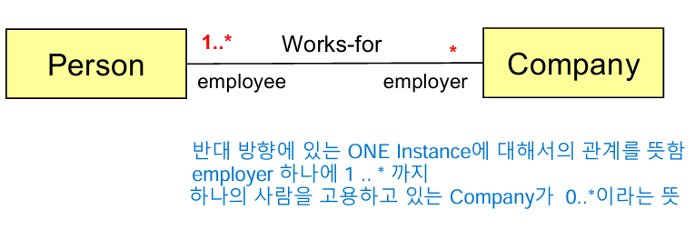

# Associations and Implementations
- analysis 단계에서 association은 분석적 관점에서만 의미 있는 관계
- design 단계에서 association은 attribute로서 구현되고, 이 속성은 instance를 가리키는 포인터 역할

- 

# High Priority Association
- A is a physical or logical part of B
- A is physically or logically contained in/on B
- A is recorded in B
- need to know 관계일 가능성이 높음 (설계 및 구현에서 모델링되어야 하는 중요한 관계)

# Summary of Assocication
- Association은 약한 의미의 relation
- 왜 이렇게 표현하는가? -> 아직 domain을 잘 모르니까
- conceptual class를 identify 하는 것도 중요하고, association을 identify하는 것도 중요함
- Domain model에 너무 많은 association을 추가하면 혼란을 일으킬 수 있음
- 중복되거나 유도 가능한 association은 피하라
- domain 이해를 돕는 Comprehension only association 사용 가능
- conceptual class는 정보를 줄 뿐만 아니라, communication tool로서 사용 가능

# Attributes
- 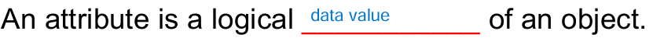
- 구성이 여러 섹션으로 이루어져있는 경우
- 다른 속성이 있는 경우
- 양을 나타내는 경우
- 추상화를 필요로 하는 경우
- attribute는 pure data value 여야하고, identity를 가지면 안됨
- 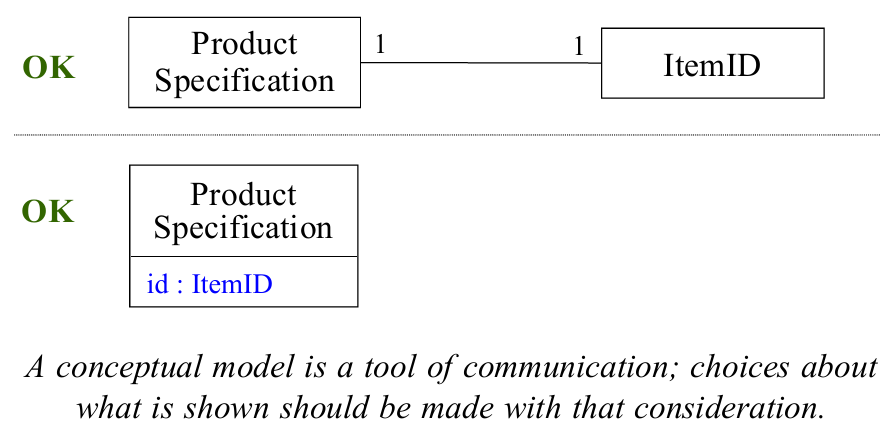
- 둘 다 괜찮은 구성
- requirements specification, Usecase, Documents들을 참조해서 생성해야 함
- attributes들은 분석동안 identified 되지않을 수 있음. 이후에 생성될 수 있음
- 

# Wrong Attributes
- 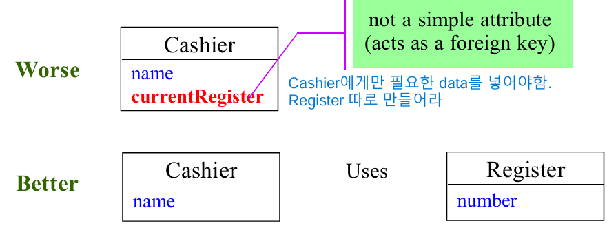
- Class와 다른 내용이라면 차라리 따로 conceptual class를 만들어서 분리시켜라

# Operation Contracts
- pre-conditions : service 이전에 완료되어야 할 것들
- post-conditions : service 이후에 완료될 것들 
- 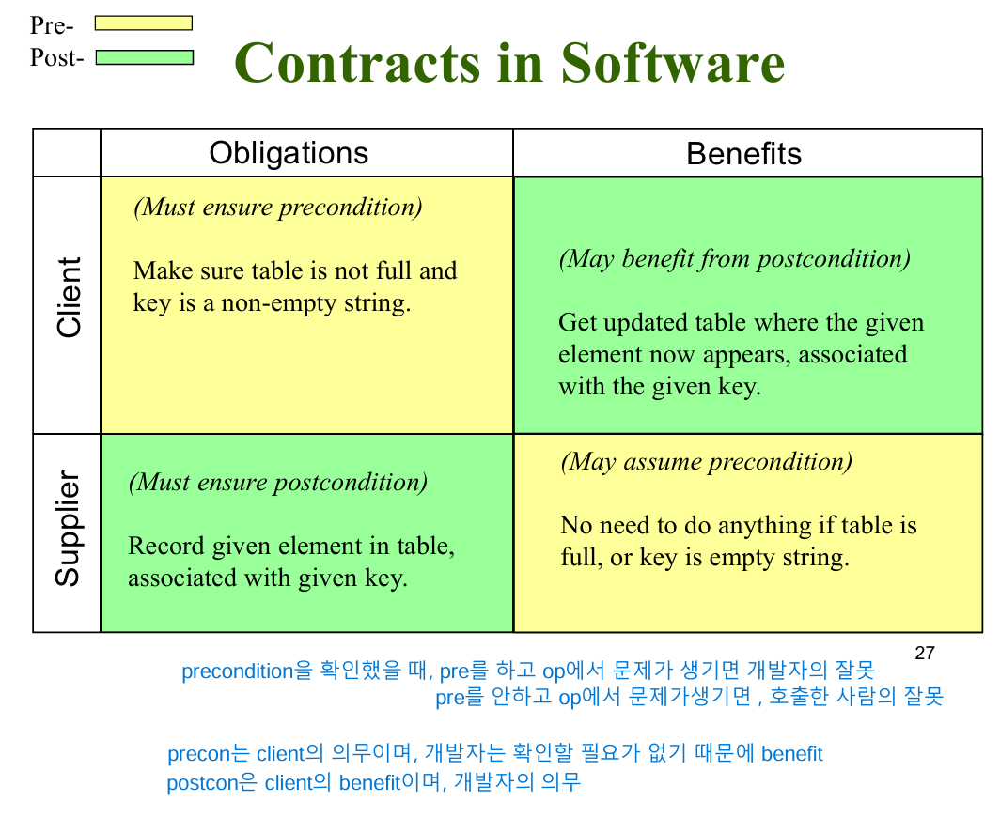

# How to make a Contract
- system sequence diagram으로 부터 system operation 식별
- 복잡한 system operation 관계 중에서 contract 생성
- post-condition을 설정하기 위해 사용하는 카테고리
- - 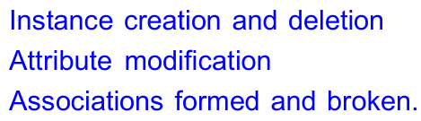

# Analysis total flow
- 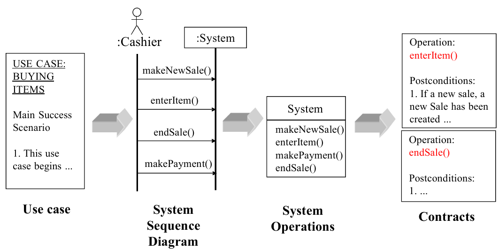

# Contract Example
- 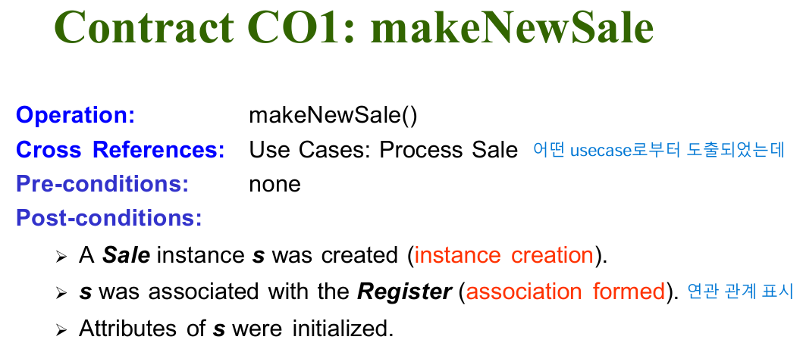
- 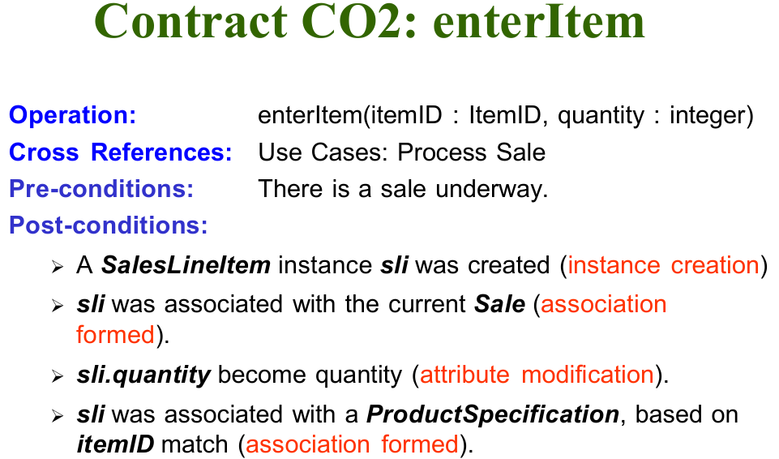
- Contract 할때는 association 관계를 정의해야 함