# Analysis Phase Conclusion
- 분석단계에서는 요구사항, 개념, system operation에 대한 이해를 강조
- process가 뭔지, 개념이 뭔지 등등 what에 대한 조사 및 분석 
- what 에 대한 focus

# Analysis Phase Artifacts
- Usecase : What are the domain processes? 
-         : What are functional requirements?
- Domain Model : What are the concepts, terms?
- System sequence diagrams : What are the system events and operations?
- Contracts : What do the system operations do?

# Design Phase
- requirements 들을 how to fullfill 에 대해 focus
- object 와 interface 관점에서, logical solution 을 강조
- Interaction diagrams , class diagrams 를 만드는 것이 Design Phase의 핵심
- 같이 design 하는 것이 이상적이지만, 동적인 model이 우선시 되어야 함

# Creation of Interaction diagrams
- requires knowledge
- - Principles of responsibility assignment
- - Design patterns, idioms

# Interaction Diagram
- Sequence or Communication을 사용해서 Interaction Diagram을 그려야 함
- Sequence Diagram: focus on time
- 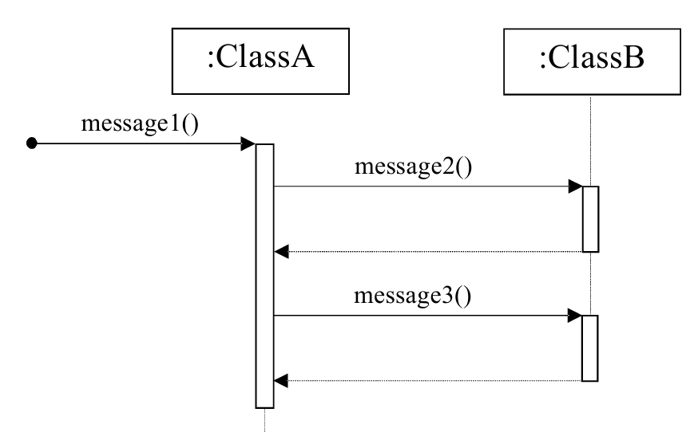
- - 시간이 위에서 아래로 흘러간다고 보면 됨
- - 한 화면에 그릴 수 있는 객체에 제한이 있음

- Communication Diagram : focus on the space(relationships between objects)
- 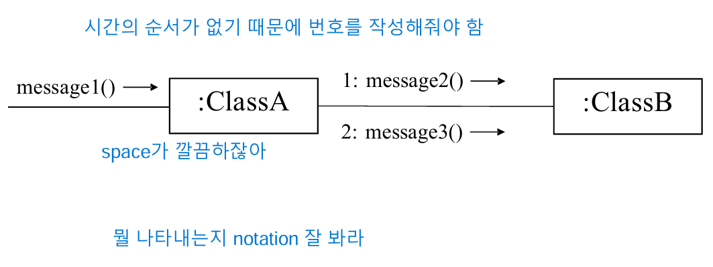
- - 시간을 명시해줘야 함

# UML Object ICON
- 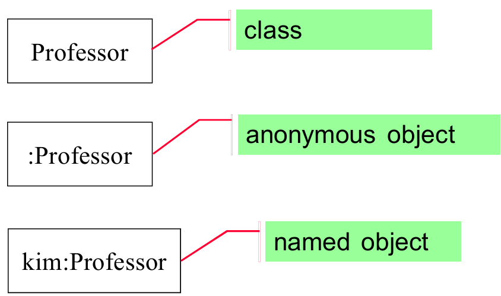
- Professor : class 
- :Professor(line) : class type의 object
- kim:Professor(line) : class type의 object로, kim이라는 이름을 가짐

# Links
- link는 association의 instance
- Sequence diagrams do not show links
- 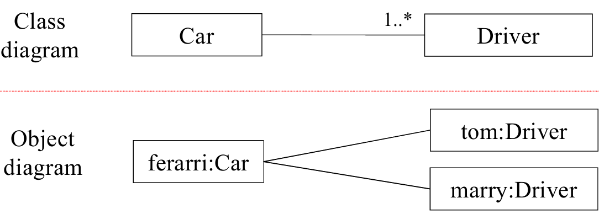
- 하나의 Car에 여러 명이 driver가 될 수 있으므로 1..*
- Object diagram에서는 ferarri라는 Car을 drive할 수 있는 driver은 Tom,marry
- *Compile 시에는 Class, Runtime 시에는 Object*
- *Compile 시에는 Association, Runtime 시에는 Link*

# Illustrating Messages(Comminication Diagram)
- 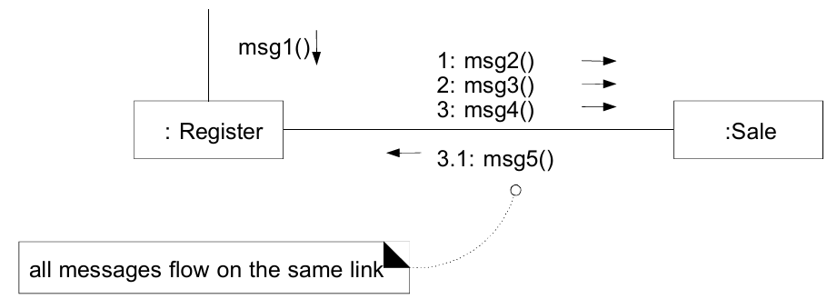
- message 들은 link 위에 설명됨
- message들은 방향이 쓰여져 있어야 함
- message에 sequence number가 추가됨
- 번호가 없는 것은 trigger message(시작 메시지)
- 메시지들 간의 인과관계를 알기 위해 3.1 처럼 사용 (dewey decimal)
- 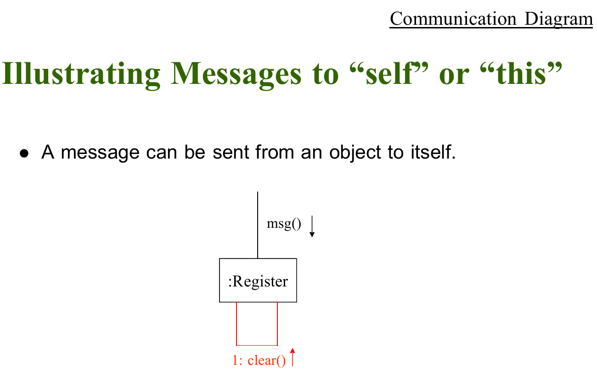

- 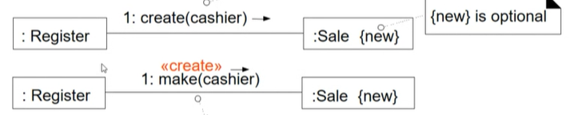
- - 생성자 creation call은 receiver가 없이 허공에다가 보내는 message {new}는 optional
- 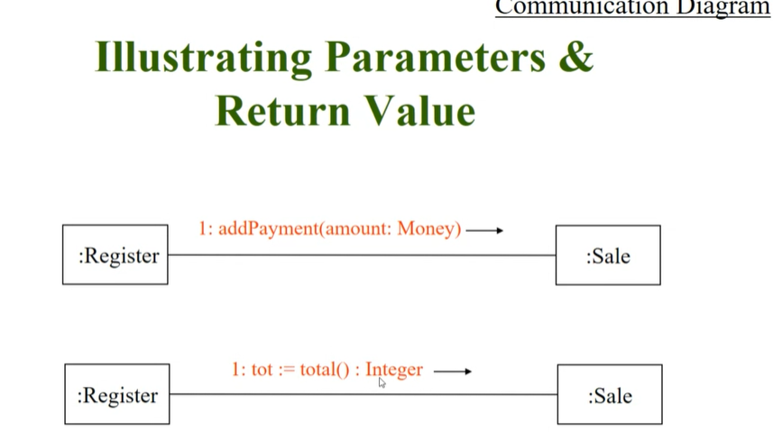
- - amount는 money type parameter
- - Integer type의 tot return

# Message Number sequence
- 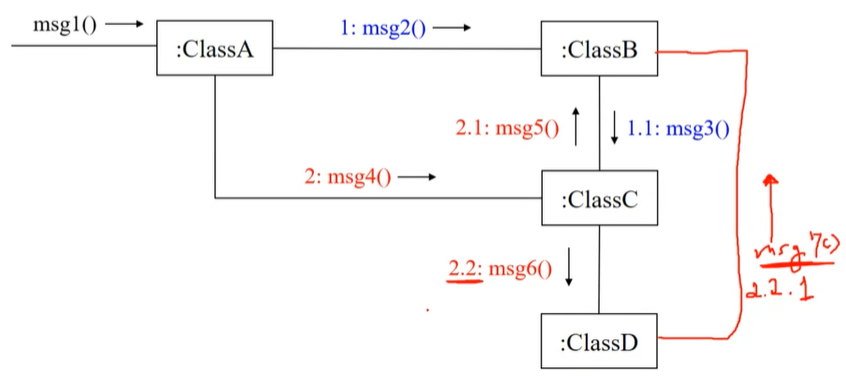
- 처음에 msg2가 call, 그로 인해 msg3가 call
- msg3 return -> msg2 return

- msg4 call - > msg5 call -> msg6 call
- msg6 return -> msg5 return -> msg4 return
- msg7 called by 2.2 -> msg7 sequence num : 2.2.1

# Illustrating Conditional Message
- 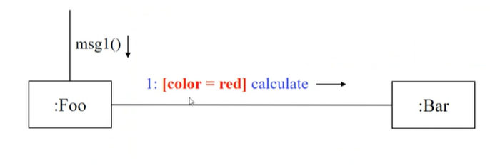
- 대괄호안에 조건에 따라서 실행
- 사진에서는 msg1()이 와서 실행하는게 아니라, 그 당시에 color == red면 실행

# Mutually Exclusive Conditional Message
- 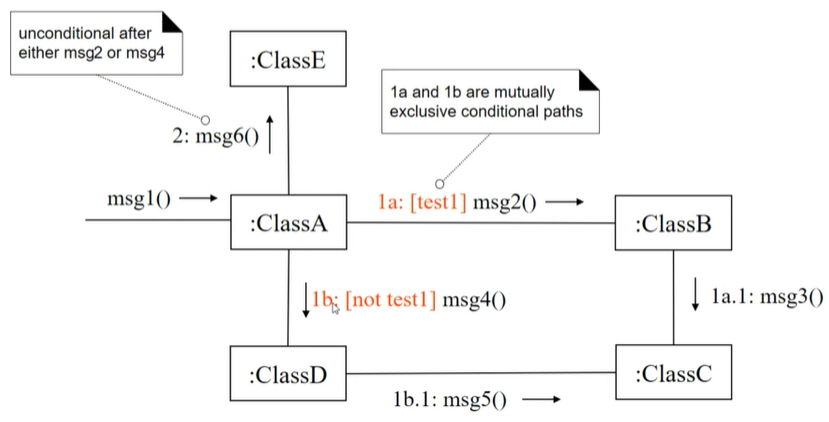
- msg1()을 받고, 다음으로 **동시에** 실행될 수 있는 것 1a, 1b으로, sequence number뒤에 알파벳을 붙여야 함
- if test, 1a 실행      else 1b 실행 
- 조건문을 실행함으로써 exclusive하게 실행
# Message to Class
- 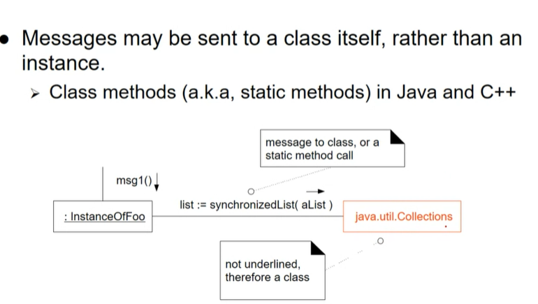
- message receiver가 class일 수 있음

# Polymorphic Message
- 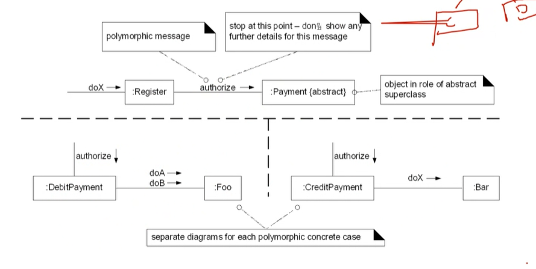
- Payment에 authorize가 왔을 때, DebitPayment or CreditPayment가 발생
- Sender 입장과 Receiver 입장을 다 그려줘야 함 
- Receiver은 각각의 subclass마다 작성해줘야 함
# Iteration or Loop
- 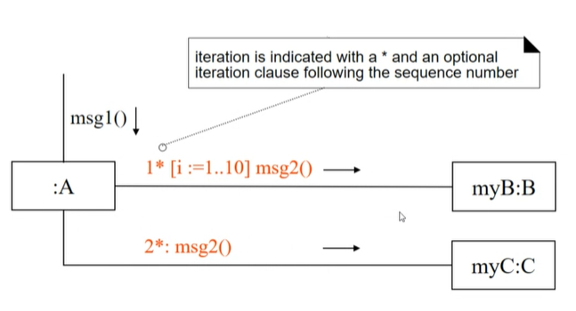
- *을 통해서 반복문 표시하고, []안에 숫자를 넣음으로써 횟수 표시 가능
- 위에꺼를 먼저 반복문을 돌린다..?
- 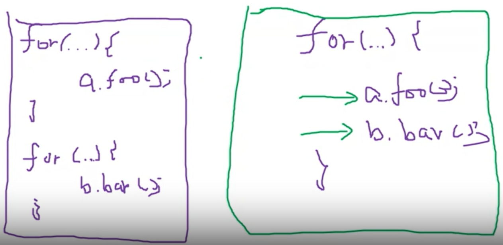
- Communication diagram에서는 이 두개를 구분하기 어려움
- Index를 i,j 처럼 구분해서 쓰거나 같게 쓰는 것으로 구분하는 것 가능
- 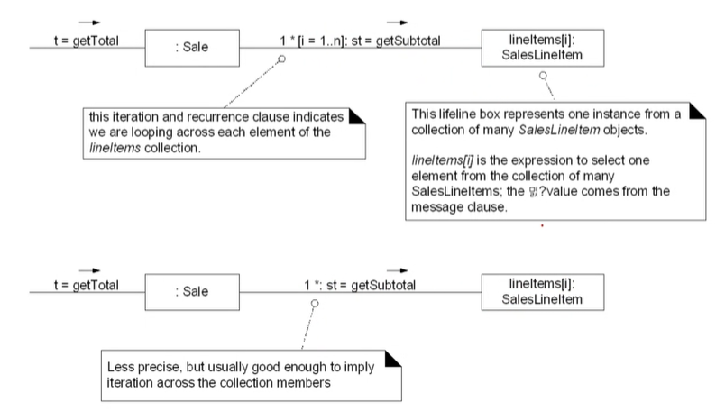
- 배열의 리스트에 값을 넣는 느낌으로, i번 반복은 생략가능

- 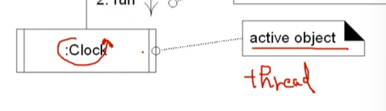
- 스스로의 thread를 가지고 있는 object

# Communication Diagram
- 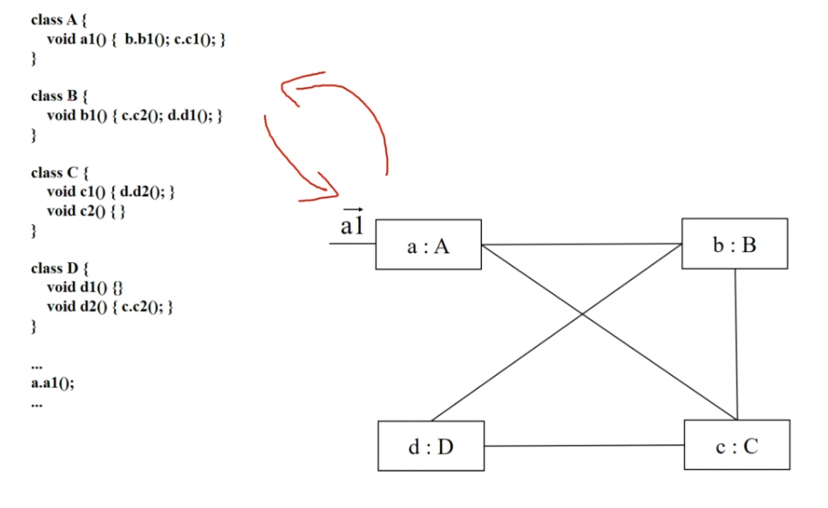

## Sequence Diagram
- 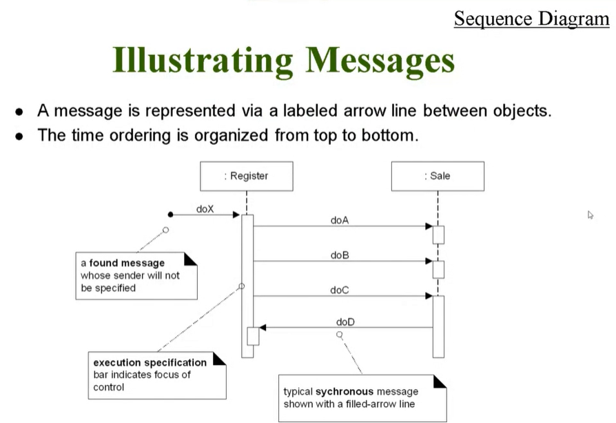
- Receiver 가 정해지진 않았으면 trigger message or found message 라고 함 
- block의 길이가 끝나면, 실행이 끝났다는 의미
- 호출이 두번됐을 때 블록을 겹침
- return 값을 갖는 message를 보낼 때는 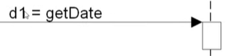
- 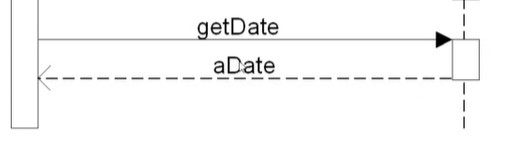
- System이 Actor에게 response하는 것은 점선으로 표시
- 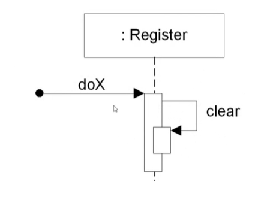
- self or this message
# Object Creation
- 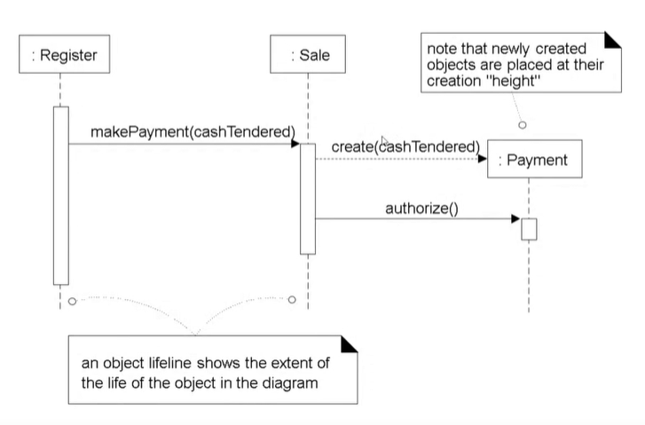
- 점선은 dependency를 의미하며, stereo type으로 <<create>>로 explict하게 표기 가능
- payment는 이전에는 존재하지 않다가, create했을 때 생성되기 때문에 그 순간부터 lifeline이 생성

# Object Destruction
- 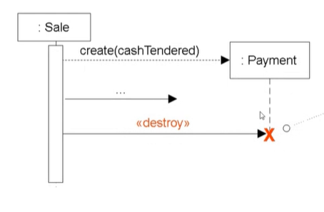

# Conditional Message
- 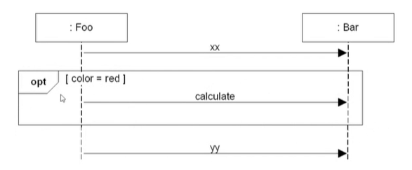
- box(Combined fragment) 안이 if문이나 loop문이 효력이 발휘하는 space 
- opt 로 왼쪽 상단에 작성하면, if문 

- 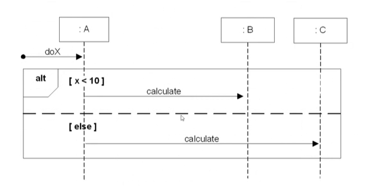
- alt는 if~else문을 뜻함
- 점선으로 구역을 표시

# Iteration or Loop
- 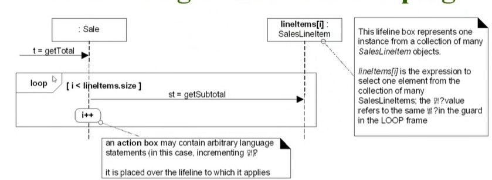
- 배열 하나하나에 메시지를 보냄
- loop로 반복문 표기
- i++는 굳이 표현하지 않아도 괜찮음

# Condition & Iteration
- 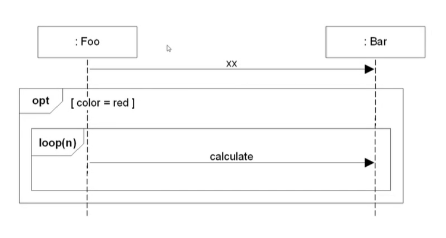
- if & loop 문 중첩하기 쉬움
- Communication diagram의 단점을 보완

# Reference
- 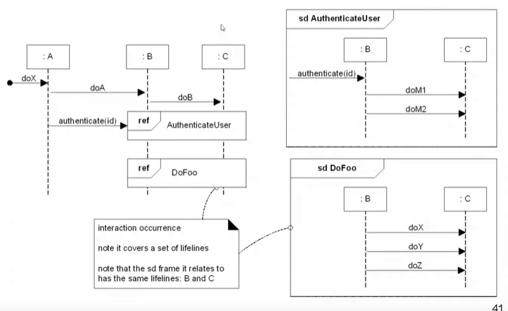
- 별도로 만들어 놓은 sd 를 참조할 수 있음
- 공간적으로 이득을 볼 수 있음

# Message to Class
- 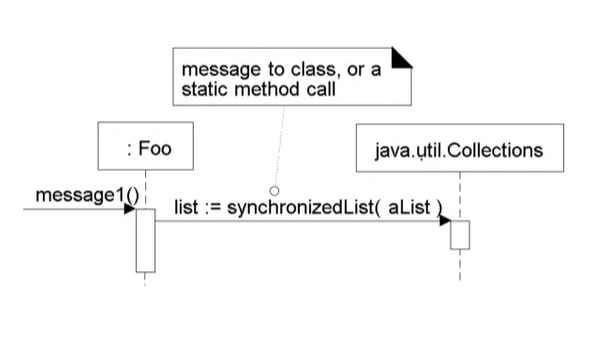
- static Method인 Message를 Class에 보내는 것도 가능