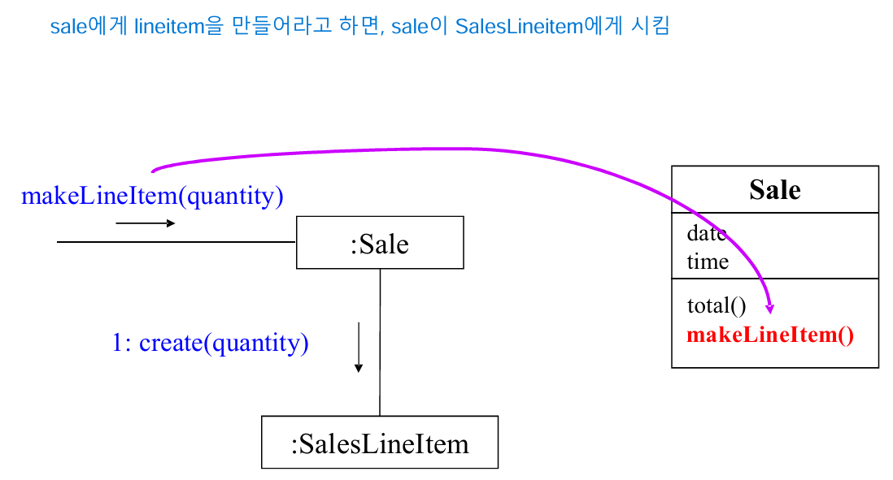

# Responsibility
- Doing responsibility : doing something itself
- Knowing responsibility : knowing about related objects
- 여러 method가 하나의 responsibility를 위해 존재할 수 있음
- Responsibility 는 OOD 동안 assign 됨

# Responsibility Assignment & Interaction Diagram
- Interaction diagram에서는 object에 reponsibility를 assign 하는, design decision을 보여줌
- Design decision에서는 어떤 메시지를 어떤 class의 object에 보내야 하는지가 반영됨
- 하나의 interaction diagram을 그리기 위해서는 가장 많은 시간과 노력을 써야 함

# GRASP Patterens
- General Responsibility Assignment Software Patterns
- Information Expert(Expert)
- Creator
- High Cohension
- Low Coupling
- Controller

# Information Expert Pattern
- 어떤 순서로 assign을 해야할 지
- Assgin a responsibility to the **Information Expert**
- Information Expert는 responsibility를 실행할 중요한 infromation을 가진 class
- 
- SalesLineItem이 ProductDescription의 price를 참조해서 quantity와 함께 조사해서 Sale에 넘겨주는게 좋지 않아?
- 
- 
- 

# Creator Pattern
- 누구에게 responsibility를 부여해야 하는가 
- 
- 

# Low Coupling Pattern
- Dependency 낮추고, 재사용성 높이기 => higher productivity
- 
- 

# High Cohesion Pattern
- 한 가지만 잘할 수 있게 정의
- 모듈화를 원한다면 **Low Coupling & High Cohesion**
- functional cohesion : responsibility에 얼마나 class들이 focus하고 related 한가 
- 
- 

# Controller Pattern
- System event를 handling 할 책임을 누가 가져야 하는가?
- Domain model로 부터 도출된 system의 대표로서, responsibility를 handling 해주는 **facade controller**
- Use-Case의 모든 system events에 대한 handler는 **Use-case controller or Session Controller**
- 외부에서 온 request를 처음 받아야 하는 것은 Controller

# Controller
- 
- Controller은 System 내부에서 request를 받는 것이 이상적
- Bloated Controllers : 하나의 controller가 모든 이벤트를 처리하며, cohesion이 낮고, 비효율적인 controller
- Bloated Controller가 되지 않으려면, **Delegate system operation responsibility to other objects**

# Typical Layered Architecture
- 
- Controller는 Presentation Layer 과 Domain Layer의 사이에 위치하며, application layer의 가장 아래에 위치
- Presentation -> Domain은 가능하지만, Domain -> Presentation처럼 역으로 올라가는 것은 안됌

# The Good & Bad Examples
- 
- 
- Controller(Register)가 system event를 handling 해주는 것이 Good
- 예외적으로, stable한 곳에 dependency가 많은 것은 괜찮음(?)