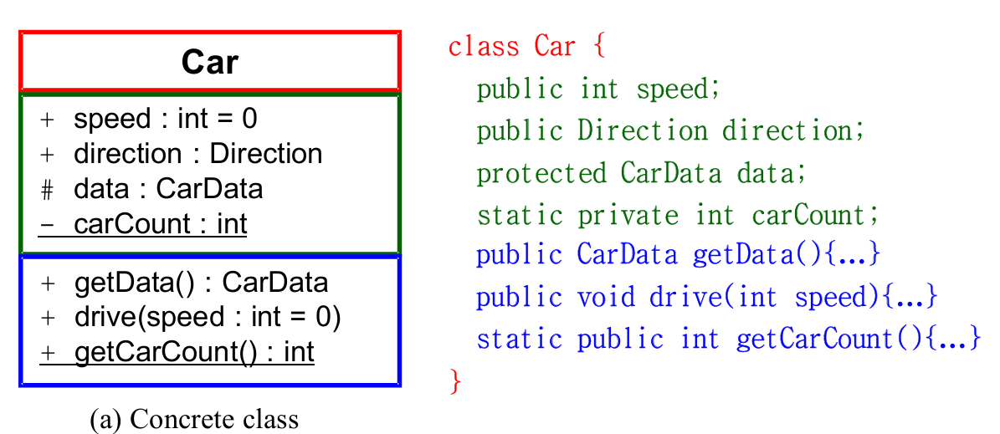

#  Use-Case Realization
- 
- Process Sale & StartUp UseCase로 Case를 공부할 예정

## Process Sale

# Contracts CO1: makeNewSale
- Pre-con : None
- Post-con : 
- - Sale instance s 생성
- - s는 Register와 associated
- - attribute s 초기화

# Creating a New Sale
- 
- Controller(Register)는 makeNewSale 요청을 받음
- 적절한 Object에 responsibility를 부여하는 Creator Pattern 수행을 통해 Sale에게 responsibility 부여
- Sale object는 내부적으로 lineItem이라는 리스트 생성

# Contract CO2 : enterItem
- Pre-con : Sale 존재 해야 함
- Post-con:
- - SalesLineItem instance sli 생성
- - sli는 Sale과 associated
- - sli.quantity는 quantity
- - sli는 ProductDescription과 associated
- 
- 이후 total은 Sale에게 responsibility를 부여하기로 함

# Model-View Separation Pattern
- Domain objects는 GUI랑 직접 소통해서는 안됌
- - support increase reuse of domain objects
- - minimize the impact of changes in the interface
- - 
- 하지만 시스템은 이 시점에서 description과 price 데이터를 알고 있어야 함

# Contract CO3: endSale()
- 
-  코드 및 글로 설명 가능

# Displaying the Sale Total
- Model-View Separation에 위배되지 않게 설계해야 함
- diagram에 정보 표시를 할때, 필요한 정보가 known 상태라면 표시해줘라
- 표시해야 할 정보는 반드시 domain object를 통해서 알 수 있어야 하고, 사용 가능해야 함

- 
- 
- - total을 Sale에서 구하기 때문에, subtotal을 LineItem 쪽에서 구하는 것이 좋아보임 

# StartUp System Operation
- StartUp은 초기화 담당
- initial domain object 생성
- <<create>> message 를 보내서 initial domain object 생성
- Start-up communication diagram은 마지막에 생성해라. 초기화 상태가 어떤 상태인지 정보를 획득한 후에 하는게 좋음

# Choosing Initial Domain Object
- Register or Store가 하게 될텐데, Register가 초기화까지 담당하면 cohension이 떨어짐
- 

# Collaboration Diagram - Start up
- 

# UI Layer to Domain Layer
- 
- 왼쪽이 전반적으로 좋음 Controller가 모두 handling하니까
- 오른쪽의 경우로 하고 싶다면, Sale 이 stable한 dependency를 가진다면 가능은 하지만 권장하지 않음

# Visibility
- Object끼리 참조를 하려면 서로의 존재를 볼 수 있어야 함
- 
- attribute visibility : B는 A의 attribute
- Parameter visibility : B는 A의 parameter
- Local visibility : B는 local variable of A
- Global visibility : B는 전역변수
- 
- attribute visibility는 <<association>> 으로 표기 

# Class Diagram
- class의 존재와 class 간의 relationship을 보여줌
- 

# Class ICON
- 
- 

# 다형성
- 
- 코드의 dependency을 줄이고, Circle 이 아닌 다른 class와도 쉽게 작동가능

# Activities and Dependency
- class diagram은 Interaction diagram + domain model

# How to Create Design Class Diagram 
- Interaction diagram에서 분석한 모든 class 식별 및 작성
- Domain model에 있는 attributes 를 Class Diagram에 복사
- Interaction diagram에서 필요한 메소드추출하여 Class에 추가
- 속성 및 메소드에 대한 데이터 타입 정보 추출
- Association 추가
- attributes 방향 설정
- dependency Line 추가(optional)

# Create Class Diagram
- 
- 